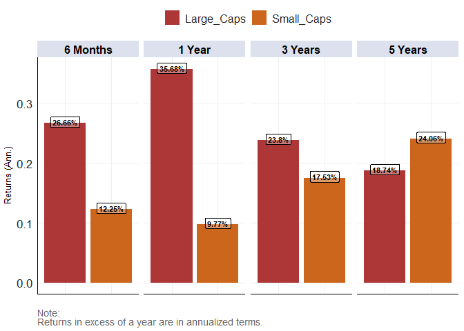
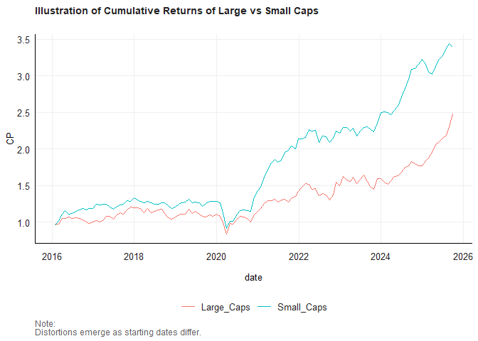
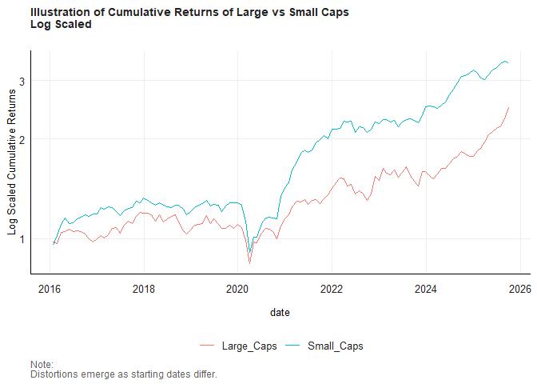
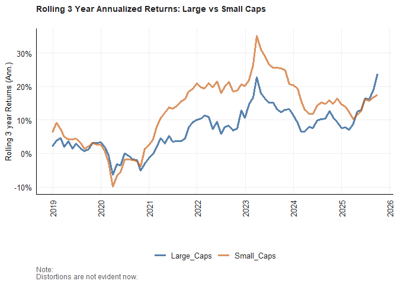
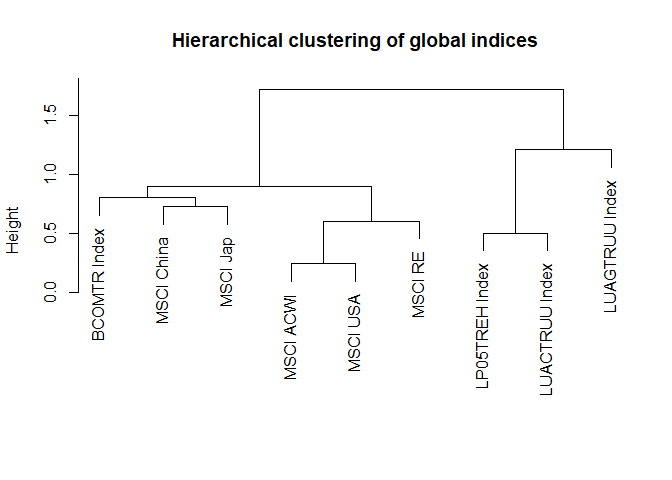

Financial Econometrics 871 Practical Exam
================

**SU Number:** 22660348  
**Author:** Precious Nhamo  
**Course:** Financial Econometrics 871  
**Dates:** 18–19 November 2025

Repo: <https://github.com/prexymtha/FMX_25_22660348>

### Question 1

I struggled with this question….

We can compute the rolling 3-year beta for each active manager and the
ABC Fund against the benchmark.Then, we can create a scatterplot of
returns vs. risk (beta) and overlay boxplots to show the distribution of
betas for peers and highlight ABC Fund.

To see how much the fund differs from the rest of the industry in terms
of what drives the return .We can perform a factor analysis or compare
the R-squared from a market model to see how much of the returns are
explained by the market.

Assess relative performance over time We can plot the cumulative returns
of ABC Fund, peers, and the benchmark.

We can compute a measure of dispersion (cross-sectional standard
deviation of returns) and then plot the fund’s performance against this
dispersion.

``` r
# Load readr for rds data sets 
pacman::p_load(readr, fmxdat)


# Load the data
Benchmark <- read_rds("data/Capped_SWIX.rds")
Active_Managers <- read_rds("data/Active_Managers.rds")
ABC_Fund <- read_rds("data/ABC_Fund.rds")
```

Since we have a benchmark , ABC fund industry peer we can’t analyse all
individual industry peers - we will calculate the mean or average of the
peers

``` r
# Load required libraries with pacman
pacman::p_load(
  dplyr,
  ggplot2,
  lubridate,
  tidyr,
  roll,
  zoo
)

# 1. Set common sample based on ABC Fund dates
start_date <- as.Date("2012-07-31")
end_date   <- as.Date("2025-10-31")

# 2. Filter each data set to the common period
benchmark_common <- 
  Benchmark %>% 
  filter(date >= start_date, date <= end_date)

active_managers_common <- 
  Active_Managers %>% 
  filter(date >= start_date, date <= end_date)

abc_data <- 
  ABC_Fund %>% 
  filter(date >= start_date, date <= end_date) %>% 
  select(date, ABC_Returns = Returns)

# 3. Prepare benchmark data
bench_data <- 
  benchmark_common %>% 
  select(date, Benchmark_Returns = Returns)

# 4. Prepare peer summary by date
peers_data <- 
  active_managers_common %>% 
  group_by(date) %>% 
  summarise(
    Peers_Avg_Returns    = mean(Returns, na.rm = TRUE),
    Peers_Median_Returns = median(Returns, na.rm = TRUE),
    Peers_Count          = n(),
    .groups              = "drop"
  )

# 5. Merge into a single analysis data set
analysis_data <- 
  abc_data %>% 
  left_join(bench_data, by = "date") %>% 
  left_join(peers_data,  by = "date")

# Optional quick check
dplyr::glimpse(analysis_data)
```

    ## Rows: 160
    ## Columns: 6
    ## $ date                 <date> 2012-07-31, 2012-08-31, 2012-09-30, 2012-10-31, …
    ## $ ABC_Returns          <dbl> 0.0349878, 0.0303066, 0.0067147, 0.0340319, 0.023…
    ## $ Benchmark_Returns    <dbl> 0.03192534, 0.02709145, 0.01197587, 0.03285995, 0…
    ## $ Peers_Avg_Returns    <dbl> 0.021872081, 0.016157091, 0.015019068, 0.03497059…
    ## $ Peers_Median_Returns <dbl> 0.02155600, 0.01871670, 0.01590045, 0.03509465, 0…
    ## $ Peers_Count          <int> 88, 87, 88, 88, 87, 88, 90, 90, 92, 91, 94, 94, 9…

We will be using analysis data to continue with our questions

``` r
pacman::p_load(
  dplyr,
  tbl2xts,
  PerformanceAnalytics
)

# Ra: assets we are analysing (ABC + peer average)
Ra_xts <- 
  analysis_data %>% 
  arrange(date) %>% 
  select(
    date,
    ABC_Fund     = ABC_Returns,
    Peer_Average = Peers_Avg_Returns
  ) %>% 
  mutate(across(-date, ~ coalesce(., 0))) %>% 
  tbl_xts(
    cols_to_xts = c("ABC_Fund", "Peer_Average")
  )

# Rb: benchmark we compare against
Rb_xts <- 
  analysis_data %>% 
  arrange(date) %>% 
  select(
    date,
    Benchmark = Benchmark_Returns
  ) %>% 
  mutate(Benchmark = coalesce(Benchmark, 0)) %>% 
  tbl_xts(
    cols_to_xts = "Benchmark"
  )
```

``` r
# Rolling 3 year betas (36 months) vs benchmark
PerformanceAnalytics::chart.RollingRegression(
  Ra         = Ra_xts,
  Rb         = Rb_xts,
  width      = 36,
  attribute  = "Beta",
  legend.loc = "topleft",
  main       = "Rolling 3 year beta vs benchmark: ABC vs peer average"
)
```

<!-- -->

``` r
# Full sample betas vs benchmark
PerformanceAnalytics::CAPM.beta(
  Ra = Ra_xts,
  Rb = Rb_xts
)
```

    ##              Beta : Benchmark
    ## ABC_Fund                0.616
    ## Peer_Average            0.845

Box-Scatter Plot ( I struggled with this part)

``` r
pacman::p_load(
  dplyr,
  tidyr,
  ggplot2,
  roll,
  fmxdat
)

# 1. Compute rolling 3 year betas (36 months) vs benchmark

# make sure data is ordered
beta_data <- 
  analysis_data %>% 
  arrange(date)

# rolling regression: y on x with width = 36
# ABC vs Benchmark
roll_abc <- 
  roll::roll_lm(
    x     = as.matrix(beta_data$Benchmark_Returns),
    y     = beta_data$ABC_Returns,
    width = 36
  )

# Peer average vs Benchmark
roll_peer <- 
  roll::roll_lm(
    x     = as.matrix(beta_data$Benchmark_Returns),
    y     = beta_data$Peers_Avg_Returns,
    width = 36
  )

# extract slope (beta) from coefficients[, 2]
rolling_betas <- 
  tibble(
    date        = beta_data$date,
    ABC_Fund    = as.numeric(roll_abc$coefficients[, 2]),
    Peer_Average = as.numeric(roll_peer$coefficients[, 2])
  ) %>% 
  pivot_longer(
    cols      = c(ABC_Fund, Peer_Average),
    names_to  = "Series",
    values_to = "Beta"
  ) %>% 
  filter(!is.na(Beta))   # drop early windows with no full 36 months

# 2. Boxplot with scatter (jitter) on top

ggplot(rolling_betas, aes(x = Series, y = Beta)) +
  geom_jitter(width = 0.1, alpha = 0.4) +   # scatter points
  geom_boxplot(width = 0.3, alpha = 0.3, outlier.shape = NA) +  # box on top
  labs(
    title = "Distribution of rolling 3 year betas vs benchmark",
    x     = NULL,
    y     = "Rolling 3 year beta"
  ) +
  theme_fmx()
```

<!-- -->

### Question 2

------------------------------------------------------------------------

``` r
# Load readr using pacman
pacman::p_load(
  readr,
  tidyverse,
  lubridate,
  tbl2xts,
  PerformanceAnalytics,
  rmsfuns,
  fmxdat,
  DescTools
)

# Load the data
Hold_Rets <- read_rds("data/Hold_Rets_Sectors.rds") 

head(Hold_Rets)
```

    ## # A tibble: 6 × 6
    ##   date       Tickers     Return Weight Group      Sector     
    ##   <date>     <chr>        <dbl>  <dbl> <chr>      <chr>      
    ## 1 2015-01-02 SAB     -0.0104    0.0419 Large_Caps Industrials
    ## 2 2015-01-02 NPN      0.00931   0.106  Large_Caps Industrials
    ## 3 2015-01-02 CFR     -0.00286   0.0251 Large_Caps Industrials
    ## 4 2015-01-02 MTN     -0.0199    0.0808 Large_Caps Industrials
    ## 5 2015-01-02 AGL     -0.00757   0.0289 Large_Caps Resources  
    ## 6 2015-01-02 SOL     -0.0000232 0.0495 Large_Caps Resources

To answer the first part of small stocks being highly volatile compared
to larger stocks I will annualise the returns for the decade as
requested by the question - I will also categorise the returns with
their groups as either being small_cap or large_cap

In the lecturer’s notes, volatility (risk) is explicitly defined and
measured using the standard deviation of returns, and we are told that:

Standard deviation should be annualised when we compare different time
periods.

The usual shortcut SD \* sqrt(12) is only theoretically correct when we
work with logarithmic returns, because annual log return is the sum of
monthly log returns, which justifies the square root of time rule.

So, to be consistent with the notes and to get a clean, comparable
volatility measure, I:

Construct value weighted indices for small caps and large caps.

Convert their monthly simple returns to log returns using log(1 + ret).

Compute a 36 month rolling standard deviation of these log monthly
returns.

Annualise that rolling SD by multiplying by sqrt(12).

This gives me a rolling annualised standard deviation of returns for
small caps and large caps over the past decade. Comparing these two
series over time is a direct, textbook implementation of the lecturer’s
definition of volatility, so it is an appropriate way to answer 2(i): if
the small cap series has a consistently higher annualised SD, we can
conclude that smaller stocks have been more volatile than larger stocks
locally.

``` r
options(dplyr.summarise.inform = FALSE)

library(tidyverse)
library(lubridate)
library(tbl2xts)
library(PerformanceAnalytics)
library(RcppRoll)
library(fmxdat)   # for safe_month_min, theme_fmx, fmx_cols, fmx_fills etc

# Start from your data
# Hold_Rets has: date, Tickers, Return, Weight, Group, Sector

Hold_Rets_decade <- 
  Hold_Rets %>% 
  filter(Group %in% c("Small_Caps", "Large_Caps")) %>% 
  mutate(year = year(date)) %>% 
  filter(year >= max(year) - 9) %>%   # last 10 calendar years
  select(-year)
```

``` r
# 1a. Daily value-weighted size index returns (Small vs Large)
idx_daily <- 
  Hold_Rets_decade %>% 
  group_by(date, Group) %>% 
  summarise(
    ret = sum(Weight * Return, na.rm = TRUE) / sum(Weight, na.rm = TRUE),
    .groups = "drop"
  ) %>% 
  rename(Tickers = Group) %>%      # so Tickers is "Small_Caps" / "Large_Caps"
  arrange(Tickers, date)

# 1b. Make returns monthly for illustration (Nico style)
idx <- 
  idx_daily %>% 
  mutate(YM = format(date, "%Y%B")) %>% 
  arrange(date) %>% 
  group_by(Tickers, YM) %>% 
  # pick last date of the month and compute monthly return
  summarise(
    date = last(date),
    ret  = prod(1 + ret, na.rm = TRUE) - 1,
    .groups = "drop"
  ) %>% 
  arrange(Tickers, date)

head(idx)
```

    ## # A tibble: 6 × 4
    ##   Tickers    YM           date            ret
    ##   <chr>      <chr>        <date>        <dbl>
    ## 1 Large_Caps 2016January  2016-01-29 -0.0239 
    ## 2 Large_Caps 2016February 2016-02-29 -0.00781
    ## 3 Large_Caps 2016March    2016-03-31  0.0805 
    ## 4 Large_Caps 2016April    2016-04-29  0.00591
    ## 5 Large_Caps 2016May      2016-05-31  0.0159 
    ## 6 Large_Caps 2016June     2016-06-30 -0.0174

``` r
#======================
# Manual Calculation:
#======================

dfplot <- 
  bind_rows(
    # 6 months – do NOT annualise (same as Nico)
    idx %>% 
      filter(date >= fmxdat::safe_month_min(last(date), N = 6)) %>% 
      group_by(Tickers) %>% 
      summarise(mu = prod(1 + ret, na.rm = TRUE) - 1) %>% 
      mutate(Freq = "A"),
    
    # 1 year
    idx %>% 
      filter(date >= fmxdat::safe_month_min(last(date), N = 12)) %>% 
      group_by(Tickers) %>% 
      summarise(mu = prod(1 + ret, na.rm = TRUE) ^ (12 / 12) - 1) %>% 
      mutate(Freq = "B"),
    
    # 3 years
    idx %>% 
      filter(date >= fmxdat::safe_month_min(last(date), N = 36)) %>% 
      group_by(Tickers) %>% 
      summarise(mu = prod(1 + ret, na.rm = TRUE) ^ (12 / 36) - 1) %>% 
      mutate(Freq = "C"),
    
    # 5 years
    idx %>% 
      filter(date >= fmxdat::safe_month_min(last(date), N = 60)) %>% 
      group_by(Tickers) %>% 
      summarise(mu = prod(1 + ret, na.rm = TRUE) ^ (12 / 60) - 1) %>% 
      mutate(Freq = "D")
  )

#======================
# PerformanceAnalytics check
#======================

idxxts <- 
  tbl_xts(idx, cols_to_xts = ret, spread_by = Tickers)

dfplotxts <- 
  bind_rows(
    idxxts %>% tail(6)  %>% Return.annualized(scale = 12) %>% data.frame() %>% mutate(Freq = "A"),
    idxxts %>% tail(12) %>% Return.annualized(scale = 12) %>% data.frame() %>% mutate(Freq = "B"),
    idxxts %>% tail(36) %>% Return.annualized(scale = 12) %>% data.frame() %>% mutate(Freq = "C"),
    idxxts %>% tail(60) %>% Return.annualized(scale = 12) %>% data.frame() %>% mutate(Freq = "D")
  ) %>% 
  data.frame() %>% 
  tidyr::gather(Tickers, mu, -Freq) %>% 
  mutate(Tickers = gsub("\\.", " ", Tickers))

# Facet labels
to_string <- as_labeller(c(
  `A` = "6 Months", 
  `B` = "1 Year", 
  `C` = "3 Years", 
  `D` = "5 Years"
))

# Barplot_foo (same style)
g_ann <- 
  dfplot %>% 
  ggplot() + 
  geom_bar(aes(Tickers, mu, fill = Tickers), stat = "identity") + 
  facet_wrap(~Freq, labeller = to_string, nrow = 1) + 
  labs(
    x = "",
    y = "Returns (Ann.)",
    caption = "Note:\nReturns in excess of a year are in annualized terms."
  ) + 
  fmx_fills() + 
  geom_label(
    aes(Tickers, mu, label = paste0(round(mu, 4) * 100, "%")),
    size = ggpts(8),
    alpha = 0.35,
    fontface = "bold",
    nudge_y = 0.002
  ) + 
  theme_fmx(
    CustomCaption = TRUE,
    title.size = ggpts(43),
    subtitle.size = ggpts(38),
    caption.size = ggpts(30),
    axis.size = ggpts(37),
    legend.size = ggpts(35),
    legend.pos = "top"
  ) +
  theme(
    axis.text.x  = element_blank(),
    axis.title.y = element_text(vjust = 2),
    strip.text.x = element_text(
      face   = "bold",
      size   = ggpts(35),
      margin = margin(.1, 0, .1, 0, "cm")
    )
  )

g_ann
```

<!-- -->

``` r
gg_cum <- 
  idx %>% 
  arrange(date) %>% 
  group_by(Tickers) %>% 
  mutate(
    Rets = coalesce(ret, 0),
    CP   = cumprod(1 + Rets)
  ) %>% 
  ungroup() %>% 
  ggplot() +
  geom_line(aes(date, CP, colour = Tickers)) +
  labs(
    title   = "Illustration of Cumulative Returns of Large vs Small Caps",
    subtitle = "",
    caption = "Note:\nDistortions emerge as starting dates differ."
  ) +
  theme_fmx(
    title.size    = ggpts(30),
    subtitle.size = ggpts(5),
    caption.size  = ggpts(25),
    CustomCaption = TRUE
  )

# Level plot
gg_cum
```

<!-- -->

``` r
# Log cumulative plot
gg_cum_log <- 
  gg_cum +
  coord_trans(y = "log10") +
  labs(
    title = paste0(gg_cum$labels$title, "\nLog Scaled"),
    y     = "Log Scaled Cumulative Returns"
  )

gg_cum_log
```

<!-- -->

``` r
plotdf <- 
  idx %>% 
  group_by(Tickers) %>% 
  mutate(
    RollRets = RcppRoll::roll_prod(1 + ret, 36, fill = NA, align = "right") ^ (12 / 36) - 1
  ) %>% 
  group_by(date) %>% 
  filter(any(!is.na(RollRets))) %>% 
  ungroup()

g_roll <- 
  plotdf %>% 
  ggplot() +
  geom_line(aes(date, RollRets, colour = Tickers), alpha = 0.7, size = 1.25) +
  labs(
    title   = "Rolling 3 Year Annualized Returns: Large vs Small Caps",
    subtitle = "",
    x       = "",
    y       = "Rolling 3 year Returns (Ann.)",
    caption = "Note:\nDistortions are not evident now."
  ) +
  theme_fmx(
    title.size    = ggpts(30),
    subtitle.size = ggpts(5),
    caption.size  = ggpts(25),
    CustomCaption = TRUE
  ) +
  fmx_cols()

finplot(g_roll, x.date.dist = "1 year", x.date.type = "%Y", x.vert = TRUE,
        y.pct = TRUE, y.pct_acc = 1)
```

<!-- -->

# This is the answer to the volatility question

``` r
plot_dlog <- 
  idx %>% 
  group_by(Tickers) %>% 
  # log monthly returns:
  mutate(ret = log(1 + ret)) %>% 
  # Rolling SD annualized calc now:
  mutate(
    RollSD = RcppRoll::roll_sd(ret, 36, fill = NA, align = "right") * sqrt(12)
  ) %>% 
  filter(!is.na(RollSD))

g_sd <- 
  plot_dlog %>% 
  ggplot() +
  geom_line(aes(date, RollSD, colour = Tickers), alpha = 0.7, size = 1.25) +
  labs(
    title   = "Rolling 3 Year Annualized SD: Large vs Small Caps",
    subtitle = "",
    x       = "",
    y       = "Rolling 3 year SD (Ann.)",
    caption = "Note:\nAnnualized SD computed on log monthly returns."
  ) +
  theme_fmx(
    title.size    = ggpts(30),
    subtitle.size = ggpts(5),
    caption.size  = ggpts(25),
    CustomCaption = TRUE
  ) +
  fmx_cols()

finplot(g_sd, x.date.dist = "1 year", x.date.type = "%Y", x.vert = TRUE,
        y.pct = FALSE)
```

<!-- -->

Second part (peak and troughs )

We need three graphs that have returns ( of whatever format on the y
axis) and year on the x axis since we have already annualised it’s easy
graph one needs to have a legend by size group ( small caps , large ,
medium and other ) , the second by sector and the last by size and
sector . Group has NA which aren’t necessarily missing values but rather
unclassified so we shall call them that to remove confusion

start with the one for return against size groups

### Question 3

### Question 4: Volatility and GARCH estimates

#### 5.4.1 Aim of the question

- We are assessing whether the South African Rand (ZAR) has been one of
  the most volatile currency over the past few years.(since it says one
  of the most we assess it relative to other currencies)

- ZAR has generally performed well during periods where the G10 currency
  carry trades have been favourable and currency valuations cheap ( we
  can split this for two and then do the joint )

- Globally, it has been one of the currencies that most benefit during
  periods where the Dollar is comparatively strong, indicating a risk-on
  sentiment

- Use your discretion on what you use to measure volatility, which
  currencies you compare and how you arrive at your conclusions. Be
  creative in using tables, graphs, stratification and statistics to
  argue your points.

- Use your discretion on what you use to measure volatility, which
  currencies you compare and how you arrive at your conclusions. Be
  creative in using tables, graphs, stratification and statistics to
  argue your points.

### Q4: Volatility and GARCH estimates for ZAR

#### 0. Libraries and data

``` r
pacman::p_load(
  tidyverse,
  devtools,
  rugarch,
  rmgarch,
  forecast,
  tbl2xts,
  lubridate,
  PerformanceAnalytics,
  ggthemes,
  robustbase,
  kableExtra,
  RcppRoll
)

# Currency data (all quoted vs USD)
cncy       <- read_rds("data/currencies.rds")
cncy_Carry <- read_rds("data/cncy_Carry.rds")   # G10 carry index
cncy_value <- read_rds("data/cncy_value.rds")   # FX PPP value index
cncyIV     <- read_rds("data/cncyIV.rds")       # FX implied vol index
bbdxy      <- read_rds("data/bbdxy.rds")        # Bloomberg Dollar spot index
```

### 1. Cross sectional volatility: ZAR vs G10 vs others

``` r
# Construct daily log returns and scaled returns for all currencies
cncy_rts <- cncy %>%  
  group_by(Name) %>%  
  arrange(date, .by_group = TRUE) %>% 
  mutate(
    dlogret   = log(Price) - log(lag(Price)),
    scaledret = dlogret - mean(dlogret, na.rm = TRUE)
  ) %>% 
  filter(date > dplyr::first(date)) %>% 
  ungroup() %>% 
  mutate(Name = gsub("_Cncy", "", Name))

# Define G10 set in the cleaned Name space
g10_vec <- c(
  "Australia_Inv",  # AUD
  "Canada",         # CAD
  "EU_Inv",         # EUR
  "Japan",          # JPY
  "NZ_Inv",         # NZD
  "Norway",         # NOK
  "Sweden",         # SEK
  "UK_Inv"          # GBP
  # USD is the base here
)

# Volatility measures since 2015
vol_cncy <- cncy_rts %>% 
  filter(date > ymd(20150101)) %>% 
  group_by(Name) %>%
  summarise(
    std_dev      = sd(dlogret, na.rm = TRUE),
    mad          = mean(abs(dlogret - mean(dlogret, na.rm = TRUE)), na.rm = TRUE),
    downside_dev = sqrt(mean(ifelse(dlogret < 0, dlogret^2, 0), na.rm = TRUE)),
    d_ratio      = (n() - sum(ifelse(dlogret < 0, dlogret, 0))) / 
                   (n() + sum(ifelse(dlogret > 0, dlogret, 0))),
    .groups = "drop"
  ) %>% 
  mutate(
    Group = case_when(
      Name == "SouthAfrica" ~ "ZAR",
      Name %in% g10_vec     ~ "G10",
      TRUE                  ~ "Other"
    )
  )

# Rank by standard deviation
ranked_data <- vol_cncy %>% 
  arrange(desc(std_dev)) %>% 
  mutate(rank = row_number()) %>% 
  select(rank, Name, Group, everything())

kableExtra::kable(
  ranked_data,
  caption = "Volatility ranking of currencies (log returns, since 2015)",
  digits = 6
)
```

| rank | Name          | Group |  std_dev |      mad | downside_dev |  d_ratio |
|-----:|:--------------|:------|---------:|---------:|-------------:|---------:|
|    1 | Ghana         | Other | 0.013370 | 0.006643 |     0.009282 | 0.999644 |
|    2 | Argentina     | Other | 0.011954 | 0.004379 |     0.004924 | 0.998619 |
|    3 | Nigeria       | Other | 0.011475 | 0.003711 |     0.004755 | 0.999548 |
|    4 | Egypt         | Other | 0.011162 | 0.001643 |     0.003064 | 0.999685 |
|    5 | Zambia        | Other | 0.010837 | 0.005351 |     0.007692 | 0.999443 |
|    6 | Brazil        | Other | 0.010719 | 0.007956 |     0.007337 | 0.999580 |
|    7 | Turkey        | Other | 0.010300 | 0.006629 |     0.006367 | 0.999208 |
|    8 | SouthAfrica   | ZAR   | 0.010190 | 0.007910 |     0.006891 | 0.999845 |
|    9 | Russia        | Other | 0.009869 | 0.006719 |     0.006652 | 0.999894 |
|   10 | Columbia      | Other | 0.008483 | 0.006102 |     0.005840 | 0.999742 |
|   11 | Mexico        | Other | 0.008389 | 0.006147 |     0.005491 | 0.999814 |
|   12 | Norway        | G10   | 0.007351 | 0.005343 |     0.004890 | 0.999930 |
|   13 | Chile         | Other | 0.006754 | 0.005056 |     0.004645 | 0.999835 |
|   14 | NZ_Inv        | G10   | 0.006429 | 0.004905 |     0.004429 | 0.999953 |
|   15 | Hungary       | Other | 0.006352 | 0.004828 |     0.004408 | 0.999902 |
|   16 | Poland        | Other | 0.006278 | 0.004746 |     0.004313 | 0.999933 |
|   17 | Australia_Inv | G10   | 0.006146 | 0.004621 |     0.004187 | 0.999953 |
|   18 | UK_Inv        | G10   | 0.006017 | 0.004267 |     0.004003 | 0.999927 |
|   19 | Sweden        | G10   | 0.005923 | 0.004458 |     0.004092 | 0.999946 |
|   20 | Czech         | Other | 0.005792 | 0.004267 |     0.004043 | 1.000017 |
|   21 | Bostwana_Inv  | Other | 0.005612 | 0.004106 |     0.003745 | 0.999899 |
|   22 | Japan         | G10   | 0.005180 | 0.003599 |     0.003780 | 1.000028 |
|   23 | Romania       | Other | 0.005109 | 0.003779 |     0.003583 | 0.999919 |
|   24 | SouthKorea    | Other | 0.005030 | 0.003748 |     0.003556 | 0.999966 |
|   25 | EU_Inv        | G10   | 0.004933 | 0.003654 |     0.003478 | 0.999974 |
|   26 | Denmark       | Other | 0.004927 | 0.003646 |     0.003475 | 0.999975 |
|   27 | Bulgaria      | Other | 0.004919 | 0.003629 |     0.003465 | 0.999972 |
|   28 | Canada        | G10   | 0.004817 | 0.003614 |     0.003391 | 0.999964 |
|   29 | Uganda        | Other | 0.004129 | 0.002076 |     0.002951 | 0.999860 |
|   30 | Malaysia      | Other | 0.003922 | 0.002492 |     0.002819 | 0.999905 |
|   31 | Peru          | Other | 0.003766 | 0.002378 |     0.002698 | 0.999836 |
|   32 | Israel        | Other | 0.003423 | 0.002110 |     0.002375 | 1.000083 |
|   33 | India         | Other | 0.003214 | 0.002256 |     0.002117 | 0.999906 |
|   34 | Singapore     | Other | 0.003086 | 0.002285 |     0.002180 | 0.999989 |
|   35 | Thailand      | Other | 0.002894 | 0.002093 |     0.002037 | 0.999995 |
|   36 | Philipines    | Other | 0.002542 | 0.001862 |     0.001693 | 0.999933 |
|   37 | China         | Other | 0.002343 | 0.001548 |     0.001622 | 0.999982 |
|   38 | Taiwan        | Other | 0.002263 | 0.001558 |     0.001661 | 1.000073 |
|   39 | HongKong      | Other | 0.000369 | 0.000210 |     0.000273 | 0.999998 |
|   40 | Saudi         | Other | 0.000153 | 0.000045 |     0.000110 | 1.000000 |
|   41 | UAE           | Other | 0.000012 | 0.000003 |     0.000009 | 1.000000 |

Volatility ranking of currencies (log returns, since 2015)

``` r
# Identify top 10 by volatility
vol_with_rank <- vol_cncy %>% 
  arrange(desc(std_dev)) %>% 
  mutate(rank = row_number())

# Keep: top 10 *or* any G10 currency
plot_set <- vol_with_rank %>% 
  filter(rank <= 10 | Group == "G10")

plot_set %>% 
  mutate(Name = fct_reorder(Name, std_dev)) %>% 
  ggplot() +
  geom_col(aes(x = Name, y = std_dev, fill = Group), alpha = 0.9) +
  scale_fill_manual(
    values = c(
      "ZAR"   = "red",
      "G10"   = "grey40",
      "Other" = "grey80"
    )
  ) +
  coord_flip() +
  labs(
    title    = "Cross sectional volatility of currencies",
    subtitle = "Top 10 currencies by volatility plus G10 majors (since 2015)",
    x = "",
    y = "Standard deviation",
    fill = ""
  ) +
  fmxdat::theme_fmx()
```

<!-- -->

------------------------------------------------------------------------

``` r
# Simple returns for ZAR only
zar_rts <- cncy %>%  
  filter(date > ymd(20150101)) %>% 
  group_by(Name) %>%  
  mutate(ret = Price / lag(Price) - 1) %>% 
  filter(date > dplyr::first(date)) %>% 
  ungroup() %>%  
  mutate(Name = gsub("_Cncy", "", Name)) %>% 
  filter(Name == "SouthAfrica") %>% 
  filter(!is.na(ret)) %>% 
  select(-Name, -Price) %>% 
  tbl_xts()

# Construct the three series: returns, squared returns, absolute returns
Plotdata <- cbind(zar_rts, zar_rts^2, abs(zar_rts))
colnames(Plotdata) <- c("Returns", "Returns_Sqd", "Returns_Abs")

Plotdata <- Plotdata %>% 
  xts_tbl() %>% 
  gather(ReturnType, Returns, -date)

ggplot(Plotdata) + 
  geom_line(aes(x = date, y = Returns, colour = ReturnType, alpha = 0.5)) + 
  ggtitle("Return Type Persistence: ZAR") + 
  facet_wrap(~ReturnType, nrow = 3, ncol = 1, scales = "free") + 
  guides(alpha = "none", colour = "none") + 
  fmxdat::theme_fmx()
```

<!-- -->

``` r
forecast::Acf(zar_rts,   main = "ACF: ZAR return")
```

<!-- -->

``` r
forecast::Acf(zar_rts^2, main = "ACF: Squared ZAR return")
```

<!-- -->

``` r
forecast::Acf(abs(zar_rts), main = "ACF: Absolute ZAR return")
```

<!-- -->

``` r
Box.test(coredata(zar_rts^2), type = "Ljung-Box", lag = 12)
```

    ## 
    ##  Box-Ljung test
    ## 
    ## data:  coredata(zar_rts^2)
    ## X-squared = 101.98, df = 12, p-value = 2.22e-16

------------------------------------------------------------------------

### 3. Fitting GARCH(1,1) to ZAR (rugarch, copy of Practical 6)

``` r
# Use the same object name as Nico: porteqw now holds ZAR returns
porteqw <- zar_rts

# GARCH(1,1) specification as in the notes
garch11 <- ugarchspec(
  variance.model = list(
    model      = c("sGARCH","gjrGARCH","eGARCH","fGARCH","apARCH")[1],
    garchOrder = c(1, 1)
  ),
  mean.model = list(
    armaOrder    = c(1, 0),
    include.mean = TRUE
  ),
  distribution.model = c("norm", "snorm", "std", "sstd", "ged", "sged", "nig", "ghyp", "jsu")[1]
)

garchfit1 <- ugarchfit(spec = garch11, data = porteqw)

garchfit1
```

    ## 
    ## *---------------------------------*
    ## *          GARCH Model Fit        *
    ## *---------------------------------*
    ## 
    ## Conditional Variance Dynamics    
    ## -----------------------------------
    ## GARCH Model  : sGARCH(1,1)
    ## Mean Model   : ARFIMA(1,0,0)
    ## Distribution : norm 
    ## 
    ## Optimal Parameters
    ## ------------------------------------
    ##         Estimate  Std. Error  t value Pr(>|t|)
    ## mu      0.000210    0.000228   0.9210 0.357051
    ## ar1     0.007943    0.024164   0.3287 0.742384
    ## omega   0.000002    0.000002   1.3423 0.179506
    ## alpha1  0.047048    0.013849   3.3972 0.000681
    ## beta1   0.932795    0.017406  53.5892 0.000000
    ## 
    ## Robust Standard Errors:
    ##         Estimate  Std. Error  t value Pr(>|t|)
    ## mu      0.000210    0.000223  0.94112  0.34664
    ## ar1     0.007943    0.023268  0.34135  0.73284
    ## omega   0.000002    0.000009  0.22713  0.82033
    ## alpha1  0.047048    0.062538  0.75231  0.45186
    ## beta1   0.932795    0.089069 10.47277  0.00000
    ## 
    ## LogLikelihood : 5680.695 
    ## 
    ## Information Criteria
    ## ------------------------------------
    ##                     
    ## Akaike       -6.3772
    ## Bayes        -6.3618
    ## Shibata      -6.3772
    ## Hannan-Quinn -6.3715
    ## 
    ## Weighted Ljung-Box Test on Standardized Residuals
    ## ------------------------------------
    ##                         statistic p-value
    ## Lag[1]                   0.008732  0.9255
    ## Lag[2*(p+q)+(p+q)-1][2]  1.010162  0.7338
    ## Lag[4*(p+q)+(p+q)-1][5]  2.538403  0.5555
    ## d.o.f=1
    ## H0 : No serial correlation
    ## 
    ## Weighted Ljung-Box Test on Standardized Squared Residuals
    ## ------------------------------------
    ##                         statistic p-value
    ## Lag[1]                      3.052 0.08064
    ## Lag[2*(p+q)+(p+q)-1][5]     6.107 0.08488
    ## Lag[4*(p+q)+(p+q)-1][9]     8.986 0.08182
    ## d.o.f=2
    ## 
    ## Weighted ARCH LM Tests
    ## ------------------------------------
    ##             Statistic Shape Scale P-Value
    ## ARCH Lag[3]    0.4316 0.500 2.000  0.5112
    ## ARCH Lag[5]    2.0366 1.440 1.667  0.4632
    ## ARCH Lag[7]    4.2021 2.315 1.543  0.3184
    ## 
    ## Nyblom stability test
    ## ------------------------------------
    ## Joint Statistic:  109.2884
    ## Individual Statistics:              
    ## mu     0.13325
    ## ar1    0.07617
    ## omega  6.56102
    ## alpha1 0.23967
    ## beta1  0.21190
    ## 
    ## Asymptotic Critical Values (10% 5% 1%)
    ## Joint Statistic:          1.28 1.47 1.88
    ## Individual Statistic:     0.35 0.47 0.75
    ## 
    ## Sign Bias Test
    ## ------------------------------------
    ##                    t-value    prob sig
    ## Sign Bias           0.1117 0.91110    
    ## Negative Sign Bias  0.6004 0.54835    
    ## Positive Sign Bias  1.8345 0.06675   *
    ## Joint Effect        8.9794 0.02957  **
    ## 
    ## 
    ## Adjusted Pearson Goodness-of-Fit Test:
    ## ------------------------------------
    ##   group statistic p-value(g-1)
    ## 1    20     33.82       0.0193
    ## 2    30     35.84       0.1782
    ## 3    40     47.28       0.1704
    ## 4    50     56.46       0.2162
    ## 
    ## 
    ## Elapsed time : 0.1826301

``` r
garch_tab <- garchfit1@fit$matcoef
kableExtra::kable(garch_tab, caption = "GARCH(1,1) estimates for ZAR")
```

|        |  Estimate | Std. Error |    t value | Pr(\>\|t\|) |
|:-------|----------:|-----------:|-----------:|------------:|
| mu     | 0.0002100 |  0.0002280 |  0.9209990 |   0.3570509 |
| ar1    | 0.0079425 |  0.0241636 |  0.3286986 |   0.7423835 |
| omega  | 0.0000021 |  0.0000016 |  1.3422773 |   0.1795061 |
| alpha1 | 0.0470482 |  0.0138493 |  3.3971619 |   0.0006809 |
| beta1  | 0.9327955 |  0.0174064 | 53.5892150 |   0.0000000 |

GARCH(1,1) estimates for ZAR

Conditional variance plot, identical structure:

``` r
sigma <- sigma(garchfit1) %>% xts_tbl() 
colnames(sigma) <- c("date", "sigma") 
sigma <- sigma %>% mutate(date = as.Date(date))

gg <- ggplot() + 
  geom_line(
    data = Plotdata %>% 
      filter(ReturnType == "Returns_Sqd") %>% 
      select(date, Returns) %>% 
      unique() %>% 
      mutate(Returns = sqrt(Returns)),
    aes(x = date, y = Returns)
  ) + 
  geom_line(
    data = sigma,
    aes(x = date, y = sigma),
    color = "red", size = 2, alpha = 0.8
  ) + 
  labs(
    title    = "Comparison: Returns sigma vs sigma from GARCH",
    subtitle = "ZAR: note the smoothing effect of GARCH as noise is controlled for.",
    x = "", y = "Estimated volatility",
    caption = "Source: Financial econometrics practical | Calculations: Own"
  ) + 
  fmxdat::theme_fmx(CustomCaption = TRUE)

fmxdat::finplot(gg, y.pct = TRUE, y.pct_acc = 1)
```

<!-- -->

News impact curve for the ZAR GARCH model:

``` r
ni <- newsimpact(z = NULL, garchfit1)

plot(
  ni$zx, ni$zy,
  ylab = ni$yexpr,
  xlab = ni$xexpr,
  type = "l",
  main = "News Impact Curve: ZAR sGARCH(1,1)"
)
```

<!-- -->

### 4. Alternative GARCH forms for ZAR (GJR and EGARCH) and NIC comparison

``` r
# GJR GARCH with student t
gjrgarch11 <- ugarchspec(
  variance.model = list(
    model      = c("sGARCH","gjrGARCH","eGARCH","fGARCH","apARCH")[2],
    garchOrder = c(1, 1)
  ),
  mean.model = list(
    armaOrder    = c(1, 0),
    include.mean = TRUE
  ),
  distribution.model = c("norm", "snorm", "std", "sstd", "ged", "sged", "nig", "ghyp", "jsu")[3]
)

garchfit2 <- ugarchfit(spec = gjrgarch11, data = as.matrix(porteqw))

kableExtra::kable(
  garchfit2@fit$matcoef,
  caption = "GJR GARCH(1,1) with student t distribution for ZAR"
)
```

|        |   Estimate | Std. Error |     t value | Pr(\>\|t\|) |
|:-------|-----------:|-----------:|------------:|------------:|
| mu     |  0.0001830 |  0.0002287 |   0.8004381 |   0.4234570 |
| ar1    |  0.0015262 |  0.0239441 |   0.0637397 |   0.9491775 |
| omega  |  0.0000012 |  0.0000007 |   1.7036342 |   0.0884494 |
| alpha1 |  0.0473653 |  0.0071176 |   6.6547069 |   0.0000000 |
| beta1  |  0.9645691 |  0.0038471 | 250.7238625 |   0.0000000 |
| gamma1 | -0.0502927 |  0.0112761 |  -4.4601190 |   0.0000082 |
| shape  | 14.0711878 |  4.0824995 |   3.4467090 |   0.0005675 |

GJR GARCH(1,1) with student t distribution for ZAR

``` r
# EGARCH(1,1) with student t
egarch11 <- ugarchspec(
  variance.model = list(
    model      = c("sGARCH","gjrGARCH","eGARCH","fGARCH","apARCH")[3],
    garchOrder = c(1, 1)
  ),
  mean.model = list(
    armaOrder    = c(1, 0),
    include.mean = TRUE
  ),
  distribution.model = c("norm", "snorm", "std", "sstd", "ged", "sged", "nig", "ghyp", "jsu")[3]
)

garchfit3 <- ugarchfit(spec = egarch11, data = as.matrix(porteqw))

# Sign bias and info criteria, as in Nico’s notes
signbias(garchfit1)
```

    ##                      t-value       prob sig
    ## Sign Bias          0.1116684 0.91109896    
    ## Negative Sign Bias 0.6003544 0.54834668    
    ## Positive Sign Bias 1.8344545 0.06675385   *
    ## Joint Effect       8.9793762 0.02956635  **

``` r
infocriteria(garchfit1)
```

    ##                       
    ## Akaike       -6.377186
    ## Bayes        -6.361780
    ## Shibata      -6.377202
    ## Hannan-Quinn -6.371496

``` r
infocriteria(garchfit2)
```

    ##                       
    ## Akaike       -6.391203
    ## Bayes        -6.369635
    ## Shibata      -6.391233
    ## Hannan-Quinn -6.383237

``` r
infocriteria(garchfit3)
```

    ##                       
    ## Akaike       -6.387688
    ## Bayes        -6.366120
    ## Shibata      -6.387718
    ## Hannan-Quinn -6.379722

News impact curves for all three, identical helper function:

``` r
NICurveMaker <- function(Fit, Name) {
  NI <- newsimpact(z = NULL, Fit)
  NI <- cbind(NI$zx, NI$zy)
  colnames(NI) <- c(paste0("Epsilon_", Name), paste0("Sigma_", Name))
  NI %>% data.frame() %>% tibble::as_tibble()
}

NI1 <- NICurveMaker(garchfit1, "GARCH11")
NI2 <- NICurveMaker(garchfit2, "GJR")
NI3 <- NICurveMaker(garchfit3, "EGARCH")

NI <- cbind(NI1, NI2, NI3) %>% 
  gather(Model, Sigma, starts_with("Sigma")) %>% 
  rename(Epsilon = Epsilon_GARCH11) %>% 
  select(-Epsilon_GJR, -Epsilon_EGARCH)

ggplot(NI) + 
  geom_line(aes(x = Epsilon, y = Sigma, colour = Model)) + 
  ggtitle("News Impact Curves: ZAR") + 
  theme_hc()
```

<!-- -->

------------------------------------------------------------------------

### 5. GO GARCH and time varying correlation between ZAR and Dollar strength

Now we bring in the multivariate flavour, matching Practical 7 style,
but on a simple two series system: ZAR and the Dollar index (bbdxy).
This speaks directly to the “benefits when the Dollar is strong”
statement.

``` r
# Dollar index log returns
g10_rts <- bbdxy %>% 
  arrange(date) %>% 
  mutate(G10 = log(Price) - log(lag(Price))) %>% 
  filter(date > dplyr::first(date)) %>% 
  select(date, G10)

# ZAR log returns (from earlier cncy_rts object)
zar_log_rts <- cncy_rts %>% 
  filter(Name == "SouthAfrica") %>% 
  rename(ZAR = dlogret) %>% 
  select(date, ZAR)

# Merge and convert to xts
xts_rtn <- left_join(g10_rts, zar_log_rts, by = "date") %>% 
  drop_na() %>% 
  tbl_xts()
```

Helper for renaming pairwise correlations (same as Practical 7):

``` r
renamingdcc <- function(ReturnSeries, DCC.TV.Cor) {
  dates <- zoo::index(ReturnSeries)
  N     <- ncol(ReturnSeries)
  names <- colnames(ReturnSeries)
  
  pairs      <- expand.grid(names, names)
  pair_names <- paste0(pairs$Var1, "_", pairs$Var2)
  
  df <- as.data.frame(DCC.TV.Cor)
  colnames(df) <- pair_names
  df$date      <- dates
  
  df %>% 
    tidyr::pivot_longer(
      cols      = -date,
      names_to  = "Pairs",
      values_to = "Rho"
    ) %>% 
    dplyr::arrange(date)
}
```

GO GARCH specification and fit, directly from Nico’s multivariate notes:

``` r
# Univariate GJR GARCH spec for each series
uspec <- ugarchspec(
  variance.model = list(
    model      = "gjrGARCH",
    garchOrder = c(1, 1)
  ),
  mean.model = list(
    armaOrder    = c(1, 0),
    include.mean = TRUE
  ),
  distribution.model = "sstd"
)

multi_univ_garch_spec <- multispec(replicate(ncol(xts_rtn), uspec))

spec.go <- gogarchspec(
  multi_univ_garch_spec,
  distribution.model = "mvnorm",
  ica                = "fastica"
)

cl <- makePSOCKcluster(10)

multf <- multifit(multi_univ_garch_spec, xts_rtn, cluster = cl)

fit.gogarch <- gogarchfit(
  spec    = spec.go,
  data    = xts_rtn,
  solver  = "hybrid",
  cluster = cl,
  gfun    = "tanh",
  maxiter1 = 40000,
  epsilon  = 1e-08,
  rseed    = 100
)

stopCluster(cl)

print(fit.gogarch)
```

    ## 
    ## *------------------------------*
    ## *        GO-GARCH Fit          *
    ## *------------------------------*
    ## 
    ## Mean Model       : CONSTANT
    ## GARCH Model      : sGARCH
    ## Distribution : mvnorm
    ## ICA Method       : fastica
    ## No. Factors      : 2
    ## No. Periods      : 4390
    ## Log-Likelihood   : 33146.13
    ## ------------------------------------
    ## 
    ## U (rotation matrix) : 
    ## 
    ##       [,1]   [,2]
    ## [1,] 0.746  0.666
    ## [2,] 0.666 -0.746
    ## 
    ## A (mixing matrix) : 
    ## 
    ##           [,1]    [,2]
    ## [1,] -0.000363 0.00406
    ## [2,]  0.008454 0.00655

Time varying correlations, same gymnastics as in the notes:

``` r
gog.time.var.cor <- rcor(fit.gogarch)
gog.time.var.cor <- aperm(gog.time.var.cor, c(3, 2, 1))
dim(gog.time.var.cor) <- c(
  nrow(gog.time.var.cor),
  ncol(gog.time.var.cor)^2
)

gog.time.var.cor <- renamingdcc(
  ReturnSeries = xts_rtn,
  DCC.TV.Cor   = gog.time.var.cor
)

g2 <- ggplot(
  gog.time.var.cor %>% 
    filter(grepl("ZAR_", Pairs), !grepl("_ZAR", Pairs))
) +
  geom_line(aes(x = date, y = Rho, colour = Pairs)) +
  theme_hc() +
  ggtitle("Go GARCH: time varying correlation between ZAR and Dollar index")

print(g2)
```

<!-- -->

------------------------------------------------------------------------

### 6. Linking to G10 carry and PPP value (for narrative)

For the second statement in the question, you can add very short extra
chunks to relate ZAR returns to:

- G10 carry index `cncy_Carry`  
- PPP value index `cncy_value`  
- FX implied vol `cncyIV`

For example, simple correlations over the sample:

``` r
# Simple daily log returns for ZAR, carry, value, and Dollar index
zar_daily <- cncy_rts %>% filter(Name == "SouthAfrica") %>% select(date, ZAR = dlogret)

carry_rts <- cncy_Carry %>% 
  arrange(date) %>% 
  mutate(Carry = log(Price) - log(lag(Price))) %>% 
  filter(!is.na(Carry)) %>% 
  select(date, Carry)

value_rts <- cncy_value %>% 
  arrange(date) %>% 
  mutate(Value = log(Price) - log(lag(Price))) %>% 
  filter(!is.na(Value)) %>% 
  select(date, Value)

dxy_rts <- bbdxy %>% 
  arrange(date) %>% 
  mutate(DXY = log(Price) - log(lag(Price))) %>% 
  filter(!is.na(DXY)) %>% 
  select(date, DXY)

link_df <- zar_daily %>% 
  inner_join(carry_rts, by = "date") %>% 
  inner_join(value_rts, by = "date") %>% 
  inner_join(dxy_rts,   by = "date")

round(cor(link_df %>% select(-date), use = "complete.obs"), 3)
```

    ##          ZAR  Carry  Value    DXY
    ## ZAR    1.000 -0.326  0.246  0.539
    ## Carry -0.326  1.000 -0.142 -0.202
    ## Value  0.246 -0.142  1.000  0.322
    ## DXY    0.539 -0.202  0.322  1.000

QUESTION 5

\## 0. Libraries

``` r
pacman::p_load(
  tidyverse,
  xts,
  tbl2xts,
  RiskPortfolios,
  PerformanceAnalytics,
  PortfolioAnalytics,
  lubridate,
  kableExtra,
  quadprog
)

devtools::source_gist("https://gist.github.com/Nicktz/bd2614f8f8a551881a1dc3c11a1e7268")
```

------------------------------------------------------------------------

\## 1. Load data and build monthly return panel

This uses monthly data from 2011 onwards and drops assets with less than
five calendar years of data.

``` r
pacman::p_load(
  tidyverse,
  xts,
  tbl2xts,
  RiskPortfolios,
  PerformanceAnalytics,
  PortfolioAnalytics,
  lubridate,
  kableExtra,
  quadprog
)

devtools::source_gist("https://gist.github.com/Nicktz/bd2614f8f8a551881a1dc3c11a1e7268")
library(readr)
library(dplyr)
# Load and filter MAA data
MAA <- read_rds("data/MAA.rds") %>%
  filter(Ticker %in% c("LUACTRUU Index", "LUAGTRUU Index",
                       "BCOMTR Index", "LP05TREH Index"))

# Load and filter MSCI data
msci <- read_rds("data/msci.rds") %>%
  filter(Name %in% c("MSCI ACWI", "MSCI USA", "MSCI RE",
                     "MSCI Jap", "MSCI China"))

# Combine benchmarks into a single tidy panel
df_full <- bind_rows(
  msci %>% rename(Tickers = Name),
  MAA  %>% select(-Name) %>% rename(Tickers = Ticker)
) %>%
  arrange(date)

# Monthly data after 2010
monthly_df <- df_full %>%
  filter(date >= ymd(20110101)) %>%       # data after 2010
  group_by(Tickers) %>%
  # Keep only assets with at least five distinct calendar years of data
  filter(n_distinct(year(date)) >= 5) %>%
  ungroup() %>%
  mutate(YM = format(date, "%Y%m")) %>%
  arrange(date) %>%
  group_by(Tickers, YM) %>%
  # Use last observation in each month
  filter(date == dplyr::last(date)) %>%
  group_by(Tickers) %>%
  mutate(ret = Price / lag(Price) - 1) %>%
  ungroup() %>%
  select(date, Tickers, ret) %>%
  filter(!is.na(ret))   # drop first NA return in each series

# Wide return matrix (monthly)
return_mat <- monthly_df %>%
  spread(Tickers, ret)

return_mat_Nodate <- data.matrix(return_mat[, -1])
```

------------------------------------------------------------------------

\## 2. Single period optimiser: `optim_foo()`

This function

- takes a look back window in months up to a given rebalance date

- keeps only assets with at least five years of data in that window

- builds Sigma and mu using `RiskPortfolios::covEstimation()` and
  geometric means

- maps tickers to asset classes according to the MAA table

- bonds and credit: government rates plus corporate credit

- commodity: BCOMTR

- equity: all MSCI indices

- builds `Amat` and `bvec` with group constraints that match the exam
  rules

- solves with `quadprog::solve.QP()` and returns weights as a tibble.

``` r
optim_foo <- function(return_mat,
                      end_date,
                      lookback_months = 120,     # at least ten years
                      LB        = 0.01,
                      UB        = 0.35,          # single asset at most 35%
                      bond_UB   = 0.25,          # bonds and credit at most 25%
                      eq_UB     = 0.60,          # equity at most 60%
                      com_UB    = 0.15) {        # commodities at most 15%
  
  # 1. Select look back window (assumes one row per month)
  window_df <- return_mat %>%
    filter(date <= end_date) %>%
    arrange(date) %>%
    slice_tail(n = lookback_months)
  
  if (nrow(window_df) < lookback_months) {
    warning("Not enough history for lookback at ", end_date)
    return(NULL)
  }
  
  # 2. Drop date and enforce at least five years of data per asset
  X <- data.matrix(window_df[, -1])
  
  # require at least 60 non NA monthly observations (about five years)
  valid_cols    <- colSums(!is.na(X)) >= 60
  X_valid       <- X[, valid_cols, drop = FALSE]
  assets_valid  <- colnames(X_valid)
  
  if (length(assets_valid) == 0) {
    warning("No assets with >= 5 years of data in window ending ", end_date)
    return(NULL)
  }
  
  # 3. Estimate covariance (Sigma) and geometric mean returns (Mu)
  Sigma <- RiskPortfolios::covEstimation(X_valid)
  
  Mu <- window_df %>%
    select(date, all_of(assets_valid)) %>%
    summarise(across(-date, ~ prod(1 + .)^(1 / n()) - 1)) %>%
    purrr::as_vector()
  
  N <- length(assets_valid)
  
  # 4. Asset class mapping for constraints
  # Based on the MAA image -table ( provided in the data set):
  # - LGAGTRUH, LUAGTRUU, LEATTREU: rates (government bonds)
  # - LGCPTREH, LUACTRUU, LP05TREH: credit (corporate bonds)
  # All of these form the "bonds and credit instruments" bucket.
  # - BCOMTR: commodity
  # - MSCI indices: equity
  asset_class <- case_when(
    assets_valid == "BCOMTR Index" ~ "Commodity",
    assets_valid %in% c(
      "LGAGTRUH Index", "LUAGTRUU Index", "LEATTREU Index",
      "LGCPTREH Index", "LUACTRUU Index", "LP05TREH Index"
    ) ~ "BondCredit",
    TRUE ~ "Equity"
  )
  
  bond_idx <- which(asset_class == "BondCredit")
  eq_idx   <- which(asset_class == "Equity")
  com_idx  <- which(asset_class == "Commodity")
  
  # 5. Base constraints (long only, fully invested, single asset caps)
  #    Amat^T w >= bvec
  Amat <- cbind(
    rep(1, N),         # sum w = 1
    diag(N),           # w_i >= LB
    -diag(N)           # -w_i >= -UB  gives w_i <= UB
  )
  
  bvec <- c(
    1,                 # fully invested
    rep(LB, N),        # lower bound
    -rep(UB, N)        # upper bound
  )
  
  # 6. Group constraints: sum over group of w_i <= cap
  add_group_constraint <- function(idx, cap, Amat, bvec) {
    if (length(idx) == 0) return(list(Amat = Amat, bvec = bvec))
    
    g_vec <- rep(0, nrow(Amat))   # rows correspond to assets
    g_vec[idx] <- -1              # -sum_{i in group} w_i >= -cap
    Amat_new <- cbind(Amat, g_vec)
    bvec_new <- c(bvec, -cap)
    list(Amat = Amat_new, bvec = bvec_new)
  }
  
  tmp <- add_group_constraint(bond_idx, bond_UB, Amat, bvec)
  Amat <- tmp$Amat; bvec <- tmp$bvec
  
  tmp <- add_group_constraint(eq_idx,   eq_UB,   Amat, bvec)
  Amat <- tmp$Amat; bvec <- tmp$bvec
  
  tmp <- add_group_constraint(com_idx,  com_UB,  Amat, bvec)
  Amat <- tmp$Amat; bvec <- tmp$bvec
  
  meq <- 1  # first constraint (sum w = 1) is equality
  
  # 7. Solve quadratic program:
  #    min (1/2) w' Sigma w - mu' w   subject to constraints
  w.opt <- quadprog::solve.QP(
    Dmat = Sigma,
    dvec = Mu,
    Amat = Amat,
    bvec = bvec,
    meq  = meq
  )$solution
  
  tibble(
    date   = end_date,
    stocks = assets_valid,
    weight = as.numeric(w.opt)
  )
}
```

------------------------------------------------------------------------

\## 3. Quarterly rebalancing dates

We work with quarter end month ends (January, April, July, October).

``` r
# Quarter end dates from the monthly series
EOQ_datevec <- return_mat %>%
  select(date) %>%
  distinct() %>%
  filter(month(date) %in% c(1, 4, 7, 10)) %>%
  pull(date)
```

------------------------------------------------------------------------

\## 4. Rolling optimiser and results

``` r
Roll_optimizer <- function(return_mat,
                           EOQ_datevec,
                           LookBackSel = 120,    # 120 months equals ten years
                           ...) {
  optim_foo(return_mat,
            end_date        = EOQ_datevec,
            lookback_months = LookBackSel,
            ...)
}

# Ten year look back as required
Result_roll <- EOQ_datevec %>%
  map_df(~ Roll_optimizer(return_mat,
                          EOQ_datevec = .,
                          LookBackSel = 120))

kable(Result_roll %>% head(13))
```

| date       | stocks         | weight |
|:-----------|:---------------|-------:|
| 2021-01-29 | BCOMTR Index   |   0.15 |
| 2021-01-29 | LP05TREH Index |   0.01 |
| 2021-01-29 | LUACTRUU Index |   0.23 |
| 2021-01-29 | LUAGTRUU Index |   0.01 |
| 2021-01-29 | MSCI ACWI      |   0.22 |
| 2021-01-29 | MSCI China     |   0.01 |
| 2021-01-29 | MSCI Jap       |   0.01 |
| 2021-01-29 | MSCI RE        |   0.01 |
| 2021-01-29 | MSCI USA       |   0.35 |
| 2021-04-30 | BCOMTR Index   |   0.15 |
| 2021-04-30 | LP05TREH Index |   0.01 |
| 2021-04-30 | LUACTRUU Index |   0.23 |
| 2021-04-30 | LUAGTRUU Index |   0.01 |

------------------------------------------------------------------------

\## 5. Stacked bar chart of portfolio weights over time

``` r
# Prepare xts object of weights at rebalance dates
bar_xts <- Result_roll %>%
  select(date, stocks, weight) %>%
  spread(stocks, weight) %>%
  tbl_xts() %>%
  .[endpoints(., "months")]

# Plot stacked weights
chart.StackedBar(
  bar_xts,
  main = "Quarterly Rebalanced Global Balanced Index Fund"
)
```

<!-- -->

``` r
# StackBar of monthly weights (Note the stand-out rebalance weights...):
#Result_roll %>% bar_xts() %>% .[endpoints(.,'months')] %>% chart.StackedBar()
```

# Clustering

Using the Practical 5
(<https://www.fmx.nfkatzke.com/posts/2020-08-17-practical-5/>), I
cluster the indices on a Ledoit–Wolf shrunk correlation matrix to
identify statistical comovement groups. The dendrogram suggests, for
example, that \[equity indices\] cluster closely, while \[bond/credit\]
and commodities sit in distinct branches.

``` r
## 6. Cluster based comovement analysis (Practical 5)

# Use the same monthly return matrix, drop date
clust_mat <- return_mat %>%
  select(-date)

# 6.1 Ledoit–Wolf covariance and correlation matrix (as in Practical 5)
Sigma_clust <- RiskPortfolios::covEstimation(
  as.matrix(clust_mat),
  control = list(type = "lw")
)

corr_clust <- cov2cor(Sigma_clust)

# 6.2 Distance matrix using the Dower metric: d_ij = sqrt( (1 - rho_ij) / 2 )
distmat <- ((1 - corr_clust) / 2)^0.5

# 6.3 Hierarchical clustering with Ward linkage (AGNES)
library(cluster)

hc <- cluster::agnes(dist(distmat), method = "ward")

# Basic dendrogram (you could beautify with the ggdendro helpers from Practical 5)
plot(hc, which.plot = 2, main = "Hierarchical clustering of global indices",
     xlab = "", sub = "")
```

<!-- -->
