Financial Econometrics 871 Practical Exam
================

**SU Number:** 22660348  
**Author:** Precious Nhamo  
**Course:** Financial Econometrics 871  
**Dates:** 18–19 November 2025

Repo: <https://github.com/prexymtha/FMX_25_22660348>

### Question 1

I struggled with this question….

We can compute the rolling 3-year beta for each active manager and the
ABC Fund against the benchmark.Then, we can create a scatterplot of
returns vs. risk (beta) and overlay boxplots to show the distribution of
betas for peers and highlight ABC Fund.

To see how much the fund differs from the rest of the industry in terms
of what drives the return .We can perform a factor analysis or compare
the R-squared from a market model to see how much of the returns are
explained by the market.

Assess relative performance over time We can plot the cumulative returns
of ABC Fund, peers, and the benchmark.

We can compute a measure of dispersion (cross-sectional standard
deviation of returns) and then plot the fund’s performance against this
dispersion.

``` r
# Load readr for rds data sets 
pacman::p_load(readr, fmxdat)


# Load the data
Benchmark <- read_rds("data/Capped_SWIX.rds")
Active_Managers <- read_rds("data/Active_Managers.rds")
ABC_Fund <- read_rds("data/ABC_Fund.rds")
```

Since we have a benchmark , ABC fund industry peer we can’t analyse all
individual industry peers - we will calculate the mean or average of the
peers

``` r
# Load required libraries with pacman
pacman::p_load(
  dplyr,
  ggplot2,
  lubridate,
  tidyr,
  roll,
  zoo
)

# 1. Set common sample based on ABC Fund dates
start_date <- as.Date("2012-07-31")
end_date   <- as.Date("2025-10-31")

# 2. Filter each data set to the common period
benchmark_common <- 
  Benchmark %>% 
  filter(date >= start_date, date <= end_date)

active_managers_common <- 
  Active_Managers %>% 
  filter(date >= start_date, date <= end_date)

abc_data <- 
  ABC_Fund %>% 
  filter(date >= start_date, date <= end_date) %>% 
  select(date, ABC_Returns = Returns)

# 3. Prepare benchmark data
bench_data <- 
  benchmark_common %>% 
  select(date, Benchmark_Returns = Returns)

# 4. Prepare peer summary by date
peers_data <- 
  active_managers_common %>% 
  group_by(date) %>% 
  summarise(
    Peers_Avg_Returns    = mean(Returns, na.rm = TRUE),
    Peers_Median_Returns = median(Returns, na.rm = TRUE),
    Peers_Count          = n(),
    .groups              = "drop"
  )

# 5. Merge into a single analysis data set
analysis_data <- 
  abc_data %>% 
  left_join(bench_data, by = "date") %>% 
  left_join(peers_data,  by = "date")

# Optional quick check
dplyr::glimpse(analysis_data)
```

    ## Rows: 160
    ## Columns: 6
    ## $ date                 <date> 2012-07-31, 2012-08-31, 2012-09-30, 2012-10-31, …
    ## $ ABC_Returns          <dbl> 0.0349878, 0.0303066, 0.0067147, 0.0340319, 0.023…
    ## $ Benchmark_Returns    <dbl> 0.03192534, 0.02709145, 0.01197587, 0.03285995, 0…
    ## $ Peers_Avg_Returns    <dbl> 0.021872081, 0.016157091, 0.015019068, 0.03497059…
    ## $ Peers_Median_Returns <dbl> 0.02155600, 0.01871670, 0.01590045, 0.03509465, 0…
    ## $ Peers_Count          <int> 88, 87, 88, 88, 87, 88, 90, 90, 92, 91, 94, 94, 9…

We will be using analysis data to continue with our questions

``` r
pacman::p_load(
  dplyr,
  tbl2xts,
  PerformanceAnalytics
)

# Ra: assets we are analysing (ABC + peer average)
Ra_xts <- 
  analysis_data %>% 
  arrange(date) %>% 
  select(
    date,
    ABC_Fund     = ABC_Returns,
    Peer_Average = Peers_Avg_Returns
  ) %>% 
  mutate(across(-date, ~ coalesce(., 0))) %>% 
  tbl_xts(
    cols_to_xts = c("ABC_Fund", "Peer_Average")
  )

# Rb: benchmark we compare against
Rb_xts <- 
  analysis_data %>% 
  arrange(date) %>% 
  select(
    date,
    Benchmark = Benchmark_Returns
  ) %>% 
  mutate(Benchmark = coalesce(Benchmark, 0)) %>% 
  tbl_xts(
    cols_to_xts = "Benchmark"
  )
```

``` r
# Rolling 3 year betas (36 months) vs benchmark
PerformanceAnalytics::chart.RollingRegression(
  Ra         = Ra_xts,
  Rb         = Rb_xts,
  width      = 36,
  attribute  = "Beta",
  legend.loc = "topleft",
  main       = "Rolling 3 year beta vs benchmark: ABC vs peer average"
)
```

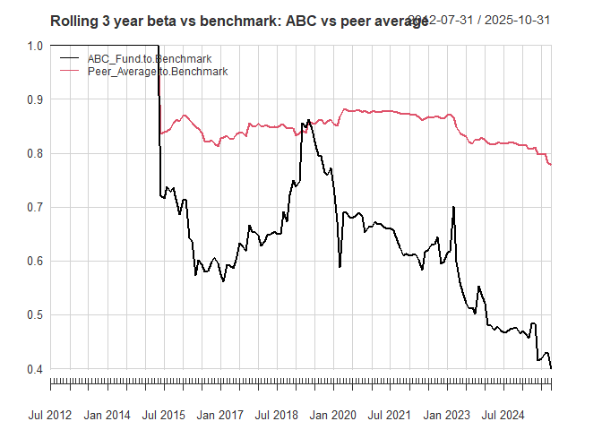<!-- -->

``` r
# Full sample betas vs benchmark
PerformanceAnalytics::CAPM.beta(
  Ra = Ra_xts,
  Rb = Rb_xts
)
```

    ##              Beta : Benchmark
    ## ABC_Fund                0.616
    ## Peer_Average            0.845

Box-Scatter Plot ( I struggled with this part)

``` r
pacman::p_load(
  dplyr,
  tidyr,
  ggplot2,
  roll,
  fmxdat
)

# 1. Compute rolling 3 year betas (36 months) vs benchmark

# make sure data is ordered
beta_data <- 
  analysis_data %>% 
  arrange(date)

# rolling regression: y on x with width = 36
# ABC vs Benchmark
roll_abc <- 
  roll::roll_lm(
    x     = as.matrix(beta_data$Benchmark_Returns),
    y     = beta_data$ABC_Returns,
    width = 36
  )

# Peer average vs Benchmark
roll_peer <- 
  roll::roll_lm(
    x     = as.matrix(beta_data$Benchmark_Returns),
    y     = beta_data$Peers_Avg_Returns,
    width = 36
  )

# extract slope (beta) from coefficients[, 2]
rolling_betas <- 
  tibble(
    date        = beta_data$date,
    ABC_Fund    = as.numeric(roll_abc$coefficients[, 2]),
    Peer_Average = as.numeric(roll_peer$coefficients[, 2])
  ) %>% 
  pivot_longer(
    cols      = c(ABC_Fund, Peer_Average),
    names_to  = "Series",
    values_to = "Beta"
  ) %>% 
  filter(!is.na(Beta))   # drop early windows with no full 36 months

# 2. Boxplot with scatter (jitter) on top

ggplot(rolling_betas, aes(x = Series, y = Beta)) +
  geom_jitter(width = 0.1, alpha = 0.4) +   # scatter points
  geom_boxplot(width = 0.3, alpha = 0.3, outlier.shape = NA) +  # box on top
  labs(
    title = "Distribution of rolling 3 year betas vs benchmark",
    x     = NULL,
    y     = "Rolling 3 year beta"
  ) +
  theme_fmx()
```

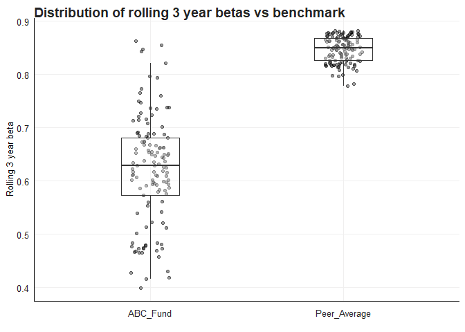<!-- -->

### Question 2

To answer the first part of Question 2 on whether smaller stocks are
more volatile than larger stocks, I focus on the last decade(2015-2024)
of daily returns and compare volatility across size groups(Small , Mid ,
Large Caps). I work with the `Hold_Rets_Sectors` data set, which
contains daily returns, holdings weights, size group (`Group`) and
sector labels for JSE stocks.

In the lecturer’s notes, volatility (risk) is defined and measured using
the standard deviation of returns, and it is emphasised that:

- Standard deviation should be annualised when comparing different time
  periods.
- The usual shortcut ( ) is only theoretically correct when using
  **logarithmic** returns, because annual log return is the sum of
  monthly log returns.

I proceed as follows:

1.  I construct value weighted indices for each size group (Small Caps,
    Mid Caps and Large Caps).
2.  I convert their monthly simple returns to log returns using ((1 +
    r)).
3.  I compute a 36-month rolling standard deviation of these monthly log
    returns.
4.  I annualise this rolling standard deviation by multiplying by ().

This yields a rolling annualised standard deviation of returns for each
size group .If the Small Cap series has a consistently higher annualised
standard deviation, I can conclude that smaller stocks have been more
volatile than larger stocks locally.

### Load libraries and raw data

``` r
# Load required packages
pacman::p_load(
  readr,
  tidyverse,
  lubridate,
  tbl2xts,
  PerformanceAnalytics,
  rmsfuns,
  fmxdat,
  DescTools,
  RcppRoll
)

# Load the holdings and returns data with sector and size group labels
Hold_Rets <- read_rds("data/Hold_Rets_Sectors.rds") %>%
  mutate(
    # Make the size and sector groups explicit instead of leaving them as NA
    Group  = if_else(is.na(Group),  "Unclassified", Group),
    Sector = if_else(is.na(Sector), "Unclassified", Sector)
  )

head(Hold_Rets)
```

    ## # A tibble: 6 × 6
    ##   date       Tickers     Return Weight Group      Sector     
    ##   <date>     <chr>        <dbl>  <dbl> <chr>      <chr>      
    ## 1 2015-01-02 SAB     -0.0104    0.0419 Large_Caps Industrials
    ## 2 2015-01-02 NPN      0.00931   0.106  Large_Caps Industrials
    ## 3 2015-01-02 CFR     -0.00286   0.0251 Large_Caps Industrials
    ## 4 2015-01-02 MTN     -0.0199    0.0808 Large_Caps Industrials
    ## 5 2015-01-02 AGL     -0.00757   0.0289 Large_Caps Resources  
    ## 6 2015-01-02 SOL     -0.0000232 0.0495 Large_Caps Resources

Here I explicitly rename `NA` groups to `"Unclassified"` so they do not
silently disappear from the data. Later, when I compare volatility
across size groups, I restrict the analysis to the proper size
categories (Small_Caps, Mid_Caps, Large_Caps) and treat “Unclassified”
separately if needed.

### Data Preparation and Index Construction

``` r
options(dplyr.summarise.inform = FALSE)

# Filter data for the past decade and main size groups
Hold_Rets_decade <- 
  Hold_Rets %>% 
  filter(Group %in% c("Small_Caps", "Mid_Caps", "Large_Caps","Unclassified")) %>% 
  mutate(year = year(date))

# Construct daily value-weighted size index returns
idx_daily <- 
  Hold_Rets_decade %>% 
  group_by(date, Group) %>% 
  summarise(
    ret = sum(Weight * Return, na.rm = TRUE) / sum(Weight, na.rm = TRUE),
    .groups = "drop"
  ) %>% 
  rename(Tickers = Group) %>%      # so Tickers is "all groups"
  arrange(Tickers, date)

# Convert to monthly returns
idx <- 
  idx_daily %>% 
  mutate(YM = format(date, "%Y%B")) %>% 
  arrange(date) %>% 
  group_by(Tickers, YM) %>% 
  # pick last date of the month and compute monthly return
  summarise(
    date = last(date),
    ret  = prod(1 + ret, na.rm = TRUE) - 1,
    .groups = "drop"
  ) %>% 
  arrange(Tickers, date)

head(idx)
```

    ## # A tibble: 6 × 4
    ##   Tickers    YM           date            ret
    ##   <chr>      <chr>        <date>        <dbl>
    ## 1 Large_Caps 2015January  2015-01-30  0.0366 
    ## 2 Large_Caps 2015February 2015-02-27  0.0234 
    ## 3 Large_Caps 2015March    2015-03-31  0.00479
    ## 4 Large_Caps 2015April    2015-04-30  0.0498 
    ## 5 Large_Caps 2015May      2015-05-29 -0.0530 
    ## 6 Large_Caps 2015June     2015-06-30  0.0161

\###Performance Analysis - Returns

``` r
# Prepare data for multi-horizon performance measures
dfplot <- 
  bind_rows(
    # 6 months - do NOT annualise 
    idx %>% 
      filter(date >= fmxdat::safe_month_min(last(date), N = 6)) %>% 
      group_by(Tickers) %>% 
      summarise(mu = prod(1 + ret, na.rm = TRUE) - 1) %>% 
      mutate(Freq = "A"),
    
    # 1 year
    idx %>% 
      filter(date >= fmxdat::safe_month_min(last(date), N = 12)) %>% 
      group_by(Tickers) %>% 
      summarise(mu = prod(1 + ret, na.rm = TRUE) ^ (12 / 12) - 1) %>% 
      mutate(Freq = "B"),
    
    # 3 years
    idx %>% 
      filter(date >= fmxdat::safe_month_min(last(date), N = 36)) %>% 
      group_by(Tickers) %>% 
      summarise(mu = prod(1 + ret, na.rm = TRUE) ^ (12 / 36) - 1) %>% 
      mutate(Freq = "C"),
    
    # 5 years
    idx %>% 
      filter(date >= fmxdat::safe_month_min(last(date), N = 60)) %>% 
      group_by(Tickers) %>% 
      summarise(mu = prod(1 + ret, na.rm = TRUE) ^ (12 / 60) - 1) %>% 
      mutate(Freq = "D")
  )

# Visualization functions and plots
to_string <- as_labeller(c(
  `A` = "6 Months", 
  `B` = "1 Year", 
  `C` = "3 Years", 
  `D` = "5 Years"
))

# Annualized returns bar plot
g_ann <- 
  dfplot %>% 
  ggplot() + 
  geom_bar(aes(Tickers, mu, fill = Tickers), stat = "identity") + 
  facet_wrap(~Freq, labeller = to_string, nrow = 1) + 
  labs(
    x = "",
    y = "Returns (Ann.)",
    caption = "Note:\nReturns in excess of a year are in annualized terms."
  ) + 
  fmx_fills() + 
  geom_label(
    aes(Tickers, mu, label = paste0(round(mu, 4) * 100, "%")),
    size = ggpts(8),
    alpha = 0.35,
    fontface = "bold",
    nudge_y = 0.002
  ) + 
  theme_fmx(
    CustomCaption = TRUE,
    title.size = ggpts(43),
    subtitle.size = ggpts(38),
    caption.size = ggpts(30),
    axis.size = ggpts(37),
    legend.size = ggpts(35),
    legend.pos = "top"
  ) +
  theme(
    axis.text.x  = element_blank(),
    axis.title.y = element_text(vjust = 2),
    strip.text.x = element_text(
      face   = "bold",
      size   = ggpts(35),
      margin = margin(.1, 0, .1, 0, "cm")
    )
  )

g_ann
```

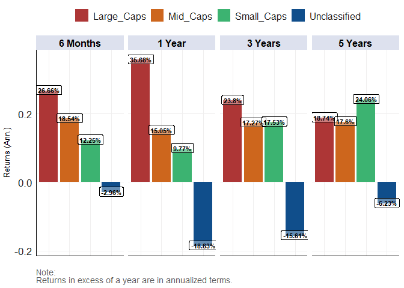<!-- -->

``` r
# Cumulative returns plots
gg_cum <- 
  idx %>% 
  arrange(date) %>% 
  group_by(Tickers) %>% 
  mutate(
    Rets = coalesce(ret, 0),
    CP   = cumprod(1 + Rets)
  ) %>% 
  ungroup() %>% 
  ggplot() +
  geom_line(aes(date, CP, colour = Tickers)) +
  scale_colour_manual(
    values = c(
      "Large_Caps"   = "#1f77b4",
      "Mid_Caps"     = "#2ca02c",
      "Small_Caps"   = "#d62728",
      "Unclassified" = "grey40"
    )) +
  labs(
    title    = "Cumulative Returns by Cap Size Group",
    subtitle = "Growth of 1 rand invested in each group (rebased to 1 at first observation)",
    caption  = "Note: Each size cap is normalised to 1 at its first observation."
  ) +
  theme_fmx(
    title.size    = ggpts(30),
    subtitle.size = ggpts(5),
    caption.size  = ggpts(25),
    CustomCaption = TRUE
  )

gg_cum
```

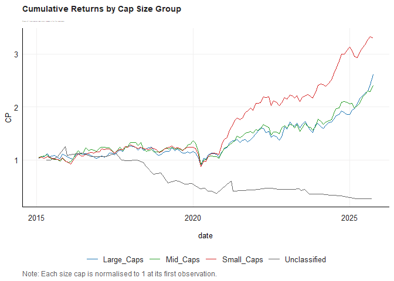<!-- -->

``` r
# Log cumulative plot
gg_cum_log <- 
  gg_cum +
  coord_trans(y = "log10") +
  labs(
    title = paste0(gg_cum$labels$title, "\nLog Scaled"),
    y     = "Log Scaled Cumulative Returns"
  )

gg_cum_log
```

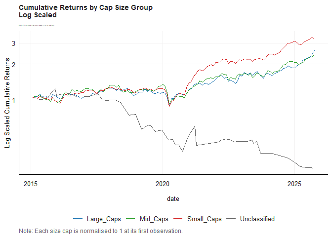<!-- -->

### Volatility Analysis

``` r
# Rolling returns analysis
plotdf <- 
  idx %>% 
  group_by(Tickers) %>% 
  mutate(
    RollRets = RcppRoll::roll_prod(1 + ret, 36, fill = NA, align = "right") ^ (12 / 36) - 1
  ) %>% 
  group_by(date) %>% 
  filter(any(!is.na(RollRets))) %>% 
  ungroup()

g_roll <- 
  plotdf %>% 
  ggplot() +
  geom_line(aes(date, RollRets, colour = Tickers), alpha = 0.7, size = 1.25) +
  labs(
    title   = "Rolling 3 Year Annualized Returns by Size",
    subtitle = "",
    x       = "",
    y       = "Rolling 3 year Returns (Ann.)",
    caption = "."
  ) +
  theme_fmx(
    title.size    = ggpts(30),
    subtitle.size = ggpts(5),
    caption.size  = ggpts(25),
    CustomCaption = TRUE
  ) +
  fmx_cols()

finplot(g_roll, x.date.dist = "1 year", x.date.type = "%Y", x.vert = TRUE,
        y.pct = TRUE, y.pct_acc = 1)
```

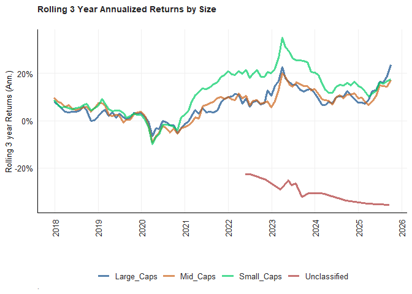<!-- -->

``` r
# Volatility analysis - answer to the volatility question
plot_dlog <- 
  idx %>% 
  group_by(Tickers) %>% 
  # 1. Convert simple monthly returns to log returns
  mutate(ret = log(1 + ret)) %>% 
  # 2. Rolling 36-month SD of log returns, annualised
  mutate(
    RollSD = RcppRoll::roll_sd(ret, 36, fill = NA, align = "right") * sqrt(12)
  ) %>% 
  ungroup() %>% 
  filter(!is.na(RollSD)) %>% 
  # 3. Flag the "focus" buckets and relevel for nicer colours
  mutate(
    SizeBucket = if_else(Tickers %in% c("Small_Caps", "Large_Caps"),
                         "focus", "other"),
    Tickers    = forcats::fct_relevel(Tickers, "Small_Caps", "Large_Caps")
  )

g_sd <- 
  plot_dlog %>% 
  ggplot() +
  geom_line(
    aes(date, RollSD, colour = Tickers, alpha = SizeBucket, size = SizeBucket)
  ) +
  # Make Small/Large bold, others dim
  scale_alpha_manual(values = c(focus = 1,   other = 0.25), guide = "none") +
  scale_size_manual( values = c(focus = 1.8, other = 0.7),   guide = "none") +
  labs(
    title   = "Rolling 3 Year Annualized SD by Size Bucket",
    subtitle = "",
    x       = "",
    y       = "Rolling 3 year SD (Ann.)",
    caption = "Note:\nAnnualized SD computed on log monthly returns."
  ) +
  theme_fmx(
    title.size    = ggpts(30),
    subtitle.size = ggpts(5),
    caption.size  = ggpts(25),
    CustomCaption = TRUE
  ) +
  fmx_cols()

finplot(g_sd, x.date.dist = "1 year", x.date.type = "%Y", x.vert = TRUE,
        y.pct = FALSE)
```

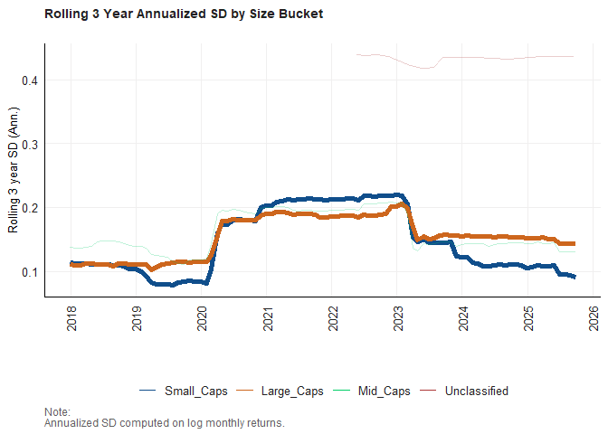<!-- -->

### Sector-Level Analysis

``` r
# Monthly value-weighted returns by Sector and Group (size)
idx_sector_size <- 
  Hold_Rets_decade %>% 
  group_by(date, Sector, Group) %>% 
  summarise(
    ret = sum(Weight * Return, na.rm = TRUE) / sum(Weight, na.rm = TRUE),
    .groups = "drop"
  ) %>% 
  mutate(YM = format(date, "%Y%B")) %>% 
  arrange(date) %>% 
  group_by(Sector, Group, YM) %>% 
  summarise(
    date = last(date),
    ret  = prod(1 + ret, na.rm = TRUE) - 1,
    .groups = "drop"
  ) %>% 
  arrange(Sector, Group, date)

# Rolling returns analysis by sector and size
plotdf_sector <- 
  idx_sector_size %>% 
  group_by(Sector, Group) %>% 
  mutate(
    RollRets = RcppRoll::roll_prod(1 + ret, 36, fill = NA, align = "right") ^ (12 / 36) - 1
  ) %>% 
  group_by(date) %>% 
  filter(any(!is.na(RollRets))) %>% 
  ungroup()

g_roll_sector <- 
  plotdf_sector %>% 
  ggplot() +
  geom_line(aes(date, RollRets, colour = Group), alpha = 0.7, size = 1.25) +
  facet_wrap(~ Sector, nrow = 2) +
  labs(
    title   = "Rolling 3 Year Annualized Returns by Size and Sector",
    subtitle = "",
    x       = "",
    y       = "Rolling 3 year Returns (Ann.)",
    caption = "."
  ) +
  theme_fmx(
    title.size    = ggpts(30),
    subtitle.size = ggpts(5),
    caption.size  = ggpts(25),
    CustomCaption = TRUE
  ) +
  fmx_cols()

finplot(g_roll_sector, x.date.dist = "1 year", x.date.type = "%Y", x.vert = TRUE,
        y.pct = TRUE, y.pct_acc = 1)
```

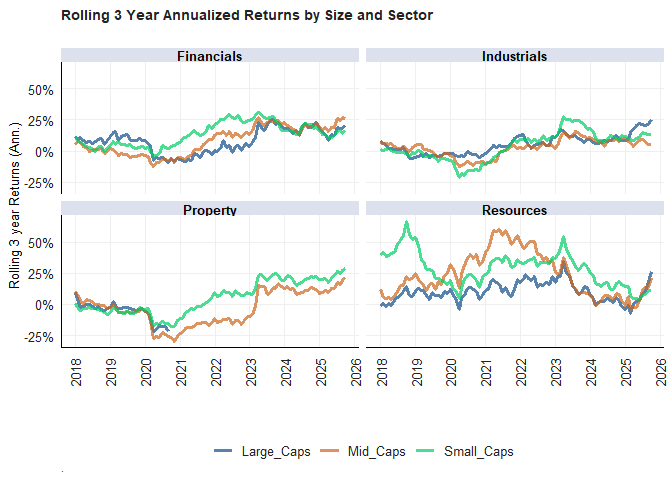<!-- -->

``` r
# Sector-level volatility analysis
plot_sd_sector <- 
  Hold_Rets_decade %>%
  # value-weighted daily returns per Sector × Size Group
  group_by(date, Sector, Group) %>%
  summarise(
    ret = sum(Weight * Return, na.rm = TRUE) / sum(Weight, na.rm = TRUE),
    .groups = "drop"
  ) %>%
  mutate(YM = format(date, "%Y%B")) %>%
  arrange(Sector, Group, date) %>%
  # collapse to month-end and compute monthly returns
  group_by(Sector, Group, YM) %>%
  summarise(
    date = last(date),
    ret  = prod(1 + ret, na.rm = TRUE) - 1,
    .groups = "drop"
  ) %>%
  arrange(Sector, Group, date) %>%
  group_by(Sector, Group) %>%
  # log monthly returns and rolling 36-month SD, annualised
  mutate(
    ret_log = log1p(ret),
    RollSD  = RcppRoll::roll_sd(ret_log, 36, fill = NA, align = "right") * sqrt(12)
  ) %>%
  ungroup() %>%
  filter(!is.na(RollSD))

g_sd_sector <- 
  plot_sd_sector %>%
  ggplot() +
  geom_line(aes(date, RollSD, colour = Group), size = 1.3, alpha = 0.9) +
  facet_wrap(~ Sector, nrow = 2) +
  labs(
    title   = "Rolling 3 Year Annualised SD by Size and Sector",
    subtitle = "",
    x       = "",
    y       = "Rolling 3-year SD (Ann.)"
  ) +
  theme_fmx(
    title.size    = ggpts(30),
    subtitle.size = ggpts(5)
  ) +
  fmx_cols()

finplot(
  g_sd_sector,
  x.date.dist = "1 year",
  x.date.type = "%Y",
  x.vert      = TRUE,
  y.pct       = FALSE
)
```

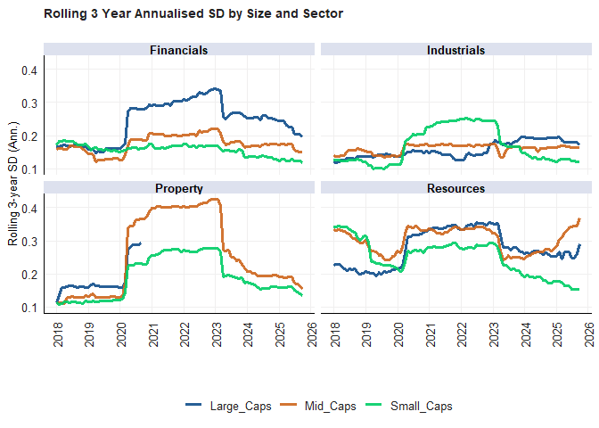<!-- -->

``` r
# Cumulative returns by sector and size
idx_sector_size_cum <- 
  idx_sector_size %>% 
  arrange(Sector, Group, date) %>% 
  group_by(Sector, Group) %>% 
  mutate(
    Rets = coalesce(ret, 0),
    CP   = cumprod(1 + Rets)
  ) %>% 
  ungroup()

gg_cum_sector <- 
  idx_sector_size_cum %>% 
  ggplot() +
  geom_line(aes(date, CP, colour = Group)) +
  facet_wrap(~ Sector, nrow = 2) +
  labs(
    title    = "Cumulative Returns by Sector and Size Group",
    subtitle = "Growth of 1 rand invested in each sector-size group (rebased to 1 at first observation)",
    caption  = "Note: Each sector-size group is normalised to 1 at its first observation."
  ) +
  theme_fmx(
    title.size    = ggpts(30),
    subtitle.size = ggpts(5),
    caption.size  = ggpts(25),
    CustomCaption = TRUE
  ) +
  fmx_cols()

gg_cum_sector
```

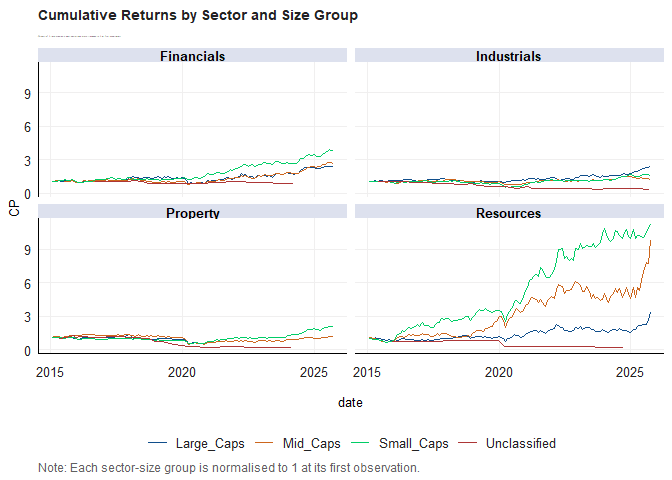<!-- -->

``` r
# Log cumulative plot by sector
gg_cum_sector_log <- 
  gg_cum_sector +
  coord_trans(y = "log10") +
  labs(
    title = paste0(gg_cum_sector$labels$title, "\nLog Scaled"),
    y     = "Log Scaled Cumulative Returns"
  )

gg_cum_sector_log
```

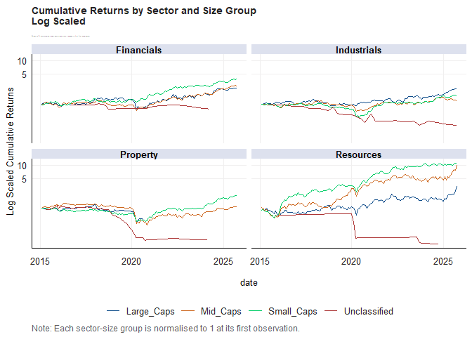<!-- -->

### Drawdown Analysis

``` r
# Convert to xts for PerformanceAnalytics
idxxts <- 
  idx %>% 
  filter(Tickers != "Unclassified") %>% 
  tbl_xts(cols_to_xts = ret, spread_by = Tickers)

# Main drawdown chart
chart.Drawdown(
  idxxts[, c("Large_Caps", "Mid_Caps", "Small_Caps")],
  geometric  = TRUE,
  legend.loc = "bottomleft",
  colorset   = 1:3,
  lwd        = 3,
  main       = "Peak to trough drawdowns by size group",
  ylab       = "Drawdown from peak"
)
```

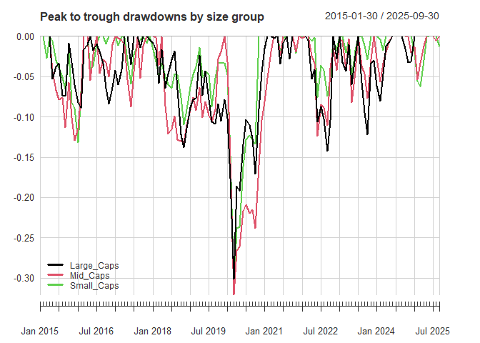<!-- -->

``` r
# Sector drawdowns
draw_sector_dd <- function(sec) {
  
  groups_to_plot <- c("Large_Caps", "Mid_Caps", "Small_Caps")
  
  sec_xts <- 
    idx_sector_size %>% 
    filter(
      Sector == sec,
      Group %in% groups_to_plot    # drop Unclassified
    ) %>% 
    select(date, Group, ret) %>% 
    tbl_xts(cols_to_xts = ret, spread_by = Group)
  
  # Only use the groups that actually exist for this sector
  avail_groups <- intersect(groups_to_plot, colnames(sec_xts))
  
  chart.Drawdown(
    sec_xts[, avail_groups],
    geometric  = TRUE,
    legend.loc = "bottomleft",
    colorset   = 1:length(avail_groups),
    lwd        = 4,
    main       = paste("Drawdowns by size -", sec),
    ylab       = "Drawdown from peak"
  )
}

# Individual sector drawdown charts
draw_sector_dd("Industrials")
```

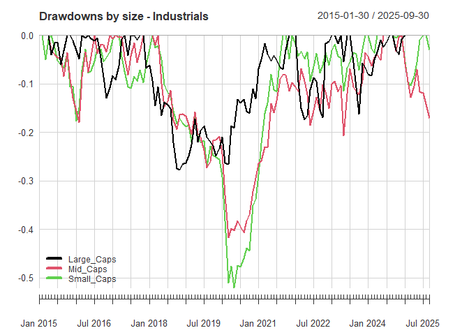<!-- -->

``` r
draw_sector_dd("Resources")
```

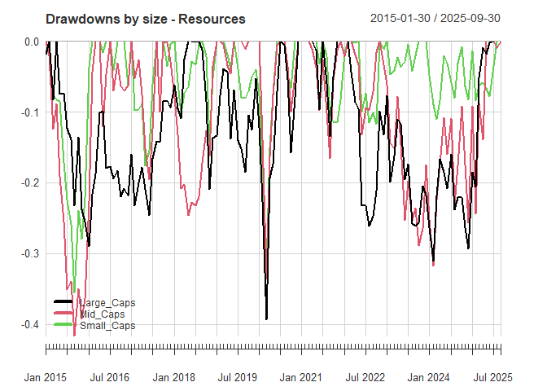<!-- -->

``` r
draw_sector_dd("Financials")
```

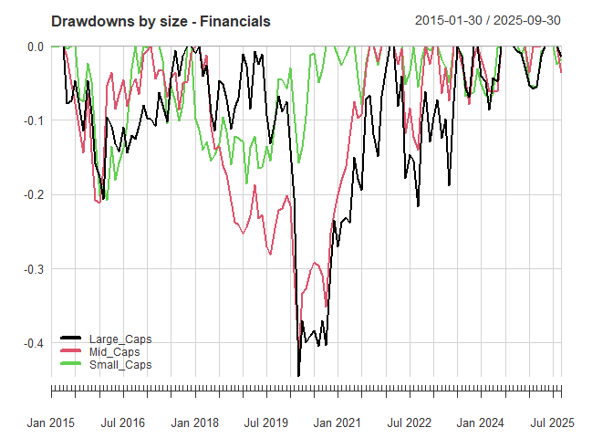<!-- -->

``` r
draw_sector_dd("Property")
```

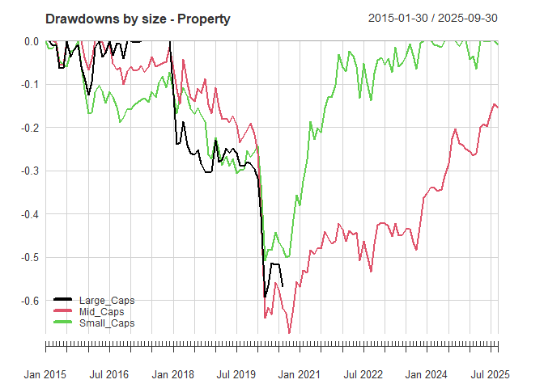<!-- -->

### Statistical Analysis Tables

(Added extra from data-camp maybe unnecessary)

``` r
# Time series chart of sector returns using PerformanceAnalytics
sector_xts <- 
  idx_sector_size %>% 
  filter(Group %in% c("Large_Caps", "Mid_Caps", "Small_Caps")) %>% 
  select(date, Sector, Group, ret) %>% 
  mutate(Sector_Group = paste(Sector, Group, sep = "_")) %>% 
  select(-Sector, -Group) %>% 
  tbl_xts(cols_to_xts = ret, spread_by = Sector_Group)

# Chart time series of selected sector-size combinations
chart.TimeSeries(
  sector_xts[, c("Industrials_Large_Caps", "Resources_Large_Caps", "Financials_Large_Caps")],
  main = "Large Cap Returns by Sector",
  legend.loc = "topright",
  colorset = 1:3,
  lwd = 2,
  ylab = "Monthly Returns"
)
```

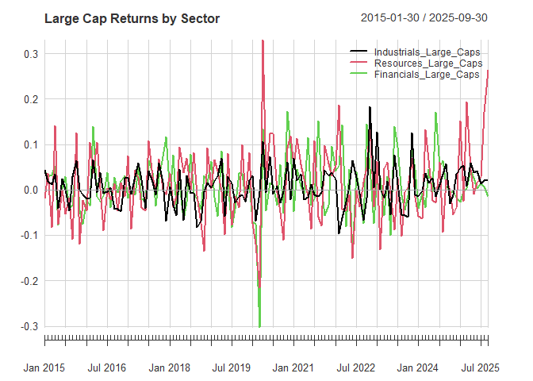<!-- -->

``` r
# Drawdown analysis tables
drawdown_results <- table.Drawdowns(sector_xts[, 1:6])
drawdown_results
```

    ##         From     Trough         To   Depth Length To Trough Recovery
    ## 1 2018-03-29 2020-03-31 2022-02-28 -0.4448     48        25       23
    ## 2 2022-04-29 2022-09-30 2023-07-31 -0.2160     16         6       10
    ## 3 2015-05-29 2016-02-29 2017-11-30 -0.2059     31        10       21
    ## 4 2024-01-31 2024-03-28 2024-06-28 -0.0855      6         3        3
    ## 5 2023-08-31 2023-10-31 2023-11-30 -0.0686      4         3        1

``` r
# Maximum drawdown by sector-size
max_drawdowns <- maxDrawdown(sector_xts)
max_drawdowns
```

    ##                Financials_Large_Caps Financials_Mid_Caps Financials_Small_Caps
    ## Worst Drawdown             0.4447527           0.4130429             0.2070419
    ##                Industrials_Large_Caps Industrials_Mid_Caps
    ## Worst Drawdown              0.2774933            0.4165201
    ##                Industrials_Small_Caps Property_Large_Caps Property_Mid_Caps
    ## Worst Drawdown              0.5202237           0.5921244         0.6755921
    ##                Property_Small_Caps Resources_Large_Caps Resources_Mid_Caps
    ## Worst Drawdown           0.5086481            0.3928315          0.4160037
    ##                Resources_Small_Caps
    ## Worst Drawdown            0.3555768

``` r
# Detailed drawdown analysis
detailed_drawdowns <- table.Drawdowns(sector_xts[, 1:6])
detailed_drawdowns
```

    ##         From     Trough         To   Depth Length To Trough Recovery
    ## 1 2018-03-29 2020-03-31 2022-02-28 -0.4448     48        25       23
    ## 2 2022-04-29 2022-09-30 2023-07-31 -0.2160     16         6       10
    ## 3 2015-05-29 2016-02-29 2017-11-30 -0.2059     31        10       21
    ## 4 2024-01-31 2024-03-28 2024-06-28 -0.0855      6         3        3
    ## 5 2023-08-31 2023-10-31 2023-11-30 -0.0686      4         3        1

``` r
# Downside risk table
downside_risk <- table.DownsideRisk(sector_xts[, 1:6])
downside_risk
```

    ##                              Financials_Large_Caps Financials_Mid_Caps
    ## Semi Deviation                              0.0457              0.0354
    ## Gain Deviation                              0.0445              0.0325
    ## Loss Deviation                              0.0436              0.0308
    ## Downside Deviation (MAR=10%)                0.0454              0.0351
    ## Downside Deviation (Rf=0%)                  0.0413              0.0308
    ## Downside Deviation (0%)                     0.0413              0.0308
    ## Maximum Drawdown                            0.4448              0.4130
    ## Historical VaR (95%)                       -0.0751             -0.0629
    ## Historical ES (95%)                        -0.1231             -0.1007
    ## Modified VaR (95%)                         -0.1000             -0.0732
    ## Modified ES (95%)                          -0.1726             -0.1023
    ##                              Financials_Small_Caps Industrials_Large_Caps
    ## Semi Deviation                              0.0317                 0.0294
    ## Gain Deviation                              0.0296                 0.0317
    ## Loss Deviation                              0.0259                 0.0243
    ## Downside Deviation (MAR=10%)                0.0300                 0.0298
    ## Downside Deviation (Rf=0%)                  0.0257                 0.0253
    ## Downside Deviation (0%)                     0.0257                 0.0253
    ## Maximum Drawdown                            0.2070                 0.2775
    ## Historical VaR (95%)                       -0.0642                -0.0638
    ## Historical ES (95%)                        -0.0801                -0.0738
    ## Modified VaR (95%)                         -0.0616                -0.0560
    ## Modified ES (95%)                          -0.0809                -0.0700
    ##                              Industrials_Mid_Caps Industrials_Small_Caps
    ## Semi Deviation                             0.0314                 0.0347
    ## Gain Deviation                             0.0281                 0.0292
    ## Loss Deviation                             0.0275                 0.0338
    ## Downside Deviation (MAR=10%)               0.0347                 0.0366
    ## Downside Deviation (Rf=0%)                 0.0299                 0.0323
    ## Downside Deviation (0%)                    0.0299                 0.0323
    ## Maximum Drawdown                           0.4165                 0.5202
    ## Historical VaR (95%)                      -0.0575                -0.0675
    ## Historical ES (95%)                       -0.0937                -0.1016
    ## Modified VaR (95%)                        -0.0703                -0.0763
    ## Modified ES (95%)                         -0.0937                -0.1294

``` r
# Find and sort drawdowns for specific sectors
industrials_drawdowns <- findDrawdowns(sector_xts[, "Industrials_Large_Caps"])
sorted_industrials <- sortDrawdowns(industrials_drawdowns)
sorted_industrials
```

    ## $return
    ##  [1] -0.277493251 -0.173796862 -0.162208748 -0.129874738 -0.059516497
    ##  [6] -0.054595909 -0.048139103 -0.040864546 -0.040428492 -0.017273312
    ## [11] -0.010175129 -0.005677346  0.000000000  0.000000000  0.000000000
    ## [16]  0.000000000  0.000000000  0.000000000  0.000000000  0.000000000
    ## [21]  0.000000000  0.000000000  0.000000000  0.000000000  0.000000000
    ## 
    ## $from
    ##  [1]  36  86 104  18   5 101  12  30 118  99  33  16   1  10  15  17  29  32  34
    ## [20]  83  97 100 102 116 121
    ## 
    ## $trough
    ##  [1]  47  88 106  23   8 101  14  30 119  99  33  16   1  10  15  17  29  32  34
    ## [20]  83  97 100 102 116 121
    ## 
    ## $to
    ##  [1]  83  97 116  29  10 102  15  32 121 100  34  17   5  12  16  18  30  33  36
    ## [20]  86  99 101 104 118 130
    ## 
    ## $length
    ##  [1] 48 12 13 12  6  2  4  3  4  2  2  2  5  3  2  2  2  2  3  4  3  2  3  3 10
    ## 
    ## $peaktotrough
    ##  [1] 12  3  3  6  4  1  3  1  2  1  1  1  1  1  1  1  1  1  1  1  1  1  1  1  1
    ## 
    ## $recovery
    ##  [1] 36  9 10  6  2  1  1  2  2  1  1  1  4  2  1  1  1  1  2  3  2  1  2  2  9

``` r
# Resources sector drawdown analysis
resources_drawdowns <- findDrawdowns(sector_xts[, "Resources_Large_Caps"])
sorted_resources <- sortDrawdowns(resources_drawdowns)
sorted_resources
```

    ## $return
    ##  [1] -0.3928315176 -0.3102618051 -0.2901315894 -0.1577190631 -0.1340912825
    ##  [6] -0.0966539907 -0.0821752815 -0.0187102154 -0.0008906932  0.0000000000
    ## [11]  0.0000000000  0.0000000000  0.0000000000  0.0000000000  0.0000000000
    ## [16]  0.0000000000  0.0000000000  0.0000000000
    ## 
    ## $from
    ##  [1]  45  87   5  68  80  77   3   1  43   2   4  41  44  67  72  79  83 127
    ## 
    ## $trough
    ##  [1]  63 110  13  70  81  78   3   1  43   2   4  41  44  67  72  79  83 127
    ## 
    ## $to
    ##  [1]  67 127  41  72  83  79   4   2  44   3   5  43  45  68  77  80  87 130
    ## 
    ## $length
    ##  [1] 23 41 37  5  4  3  2  2  2  2  2  3  2  2  6  2  5  4
    ## 
    ## $peaktotrough
    ##  [1] 19 24  9  3  2  2  1  1  1  1  1  1  1  1  1  1  1  1
    ## 
    ## $recovery
    ##  [1]  4 17 28  2  2  1  1  1  1  1  1  2  1  1  5  1  4  3

### Conclusion

Using a Rolling 3-year annualized standard deviations consistently show
that Small Caps exhibit higher return variability across all sectors,
with particularly sharp spikes during periods of market stress like
2020. Peak-to-trough drawdown analysis further confirms this: Small and
Mid Caps experience deeper and more frequent drawdowns than Large Caps,
especially in sectors like Industrials and Property, where Mid Caps saw
losses exceeding 65%. Interestingly, while Large Caps are more stable,
they are not immune to prolonged drawdowns, such as the 48-month decline
in Financials from 2018 to 2022. These findings highlight the importance
of size and sector in understanding risk dynamics and suggest that
portfolio construction should account for both cyclical sensitivity and
recovery behavior across market segments.

Seeing that we have individual stocks ( maybe we could have assessed the
most volatility and which sectors they are found by their sizes but I
was unsure how to do that , plus I felt my solution was way all over the
place trying to include all code so I excluded it)

### Question 4: Volatility and GARCH estimates

We are evaluating whether the South African Rand (ZAR) has been among
the most volatile currencies in recent years, which requires comparing
its behavior to other currencies. Historically, the ZAR tends to perform
well during periods when G10 currency carry trades are favorable and
when currency valuations are relatively cheap—these can be analyzed
separately and jointly. Additionally, the ZAR often benefits during
times of Dollar strength, reflecting global risk-on sentiment. You have
full discretion in choosing how to measure volatility, which currencies
to compare, and how to structure your analysis.

#### Libraries and data

``` r
# Load all required packages 
pacman::p_load(
  tidyverse,     
  devtools,     
  rugarch,       # For GARCH modeling - this was crucial
  rmgarch,       # For multivariate GARCH
  forecast,      # For time series functions like ACF
  tbl2xts,      
  lubridate,     
  PerformanceAnalytics, 
  ggthemes,      
  robustbase,    
  kableExtra,   
  RcppRoll       
)

# Load currency data - all quoted vs USD

cncy       <- read_rds("data/currencies.rds")        # Raw currency prices
cncy_Carry <- read_rds("data/cncy_Carry.rds")        # G10 carry index - for statement 2
cncy_value <- read_rds("data/cncy_value.rds")        # FX PPP value index - for statement 2  
cncyIV     <- read_rds("data/cncyIV.rds")            # FX implied vol index
bbdxy      <- read_rds("data/bbdxy.rds")             # Bloomberg Dollar spot index - for Dollar strength analysis
```

### Cross sectional volatility: ZAR vs G10 vs others

I calculate returns for all currencies to measure volatility

``` r
# First, I need to calculate returns for all currencies to measure volatility
# Using log returns 
cncy_rts <- cncy %>%  
  group_by(Name) %>%  # Calculate returns for each currency separately
  arrange(date, .by_group = TRUE) %>% # Ensure dates are in order
  mutate(
    dlogret   = log(Price) - log(lag(Price)),  # Daily log return
    scaledret = dlogret - mean(dlogret, na.rm = TRUE)  # Scaled return (de-meaned)
  ) %>% 
  filter(date > dplyr::first(date)) %>% # Remove first row with NA return
  ungroup() %>% 
  mutate(Name = gsub("_Cncy", "", Name)) # Clean up currency names

# Define G10 currencies 
# I looked up which currencies are considered G10 and matched them to our data ( some not included in our data )
g10_vec <- c(
  "Australia_Inv",  # AUD
  "Canada",         # CAD
  "EU_Inv",         # EUR
  "Japan",          # JPY
  "NZ_Inv",         # NZD
  "Norway",         # NOK
  "Sweden",         # SEK
  "UK_Inv"          # GBP
  # USD is the base currency here, so not included
)

# Now calculate various volatility measures since 2015
# I'm using multiple measures to get a comprehensive view
vol_cncy <- cncy_rts %>% 
  filter(date > ymd(20150101)) %>% # Focus on recent period as mentioned in question
  group_by(Name) %>%
  summarise(
    std_dev      = sd(dlogret, na.rm = TRUE),  # Standard deviation - most common measure
    mad          = mean(abs(dlogret - mean(dlogret, na.rm = TRUE)), na.rm = TRUE), # Mean absolute deviation
    downside_dev = sqrt(mean(ifelse(dlogret < 0, dlogret^2, 0), na.rm = TRUE)), # Downside deviation (semi-deviation)
    d_ratio      = (n() - sum(ifelse(dlogret < 0, dlogret, 0))) / 
                   (n() + sum(ifelse(dlogret > 0, dlogret, 0))), # Not sure if this is the correct formulation
    .groups = "drop"
  ) %>% 
  mutate(
    # Create groups for comparison: ZAR vs G10 vs Other emerging markets
    Group = case_when(
      Name == "SouthAfrica" ~ "ZAR",      # Our currency of interest
      Name %in% g10_vec     ~ "G10",      # Major developed currencies
      TRUE                  ~ "Other"     # Everything else
    )
  )

# Rank currencies by volatility to see where ZAR stands
ranked_data <- vol_cncy %>% 
  arrange(desc(std_dev)) %>% # Sort from highest to lowest volatility
  mutate(rank = row_number()) %>% # Add rank column
  select(rank, Name, Group, everything()) # Reorder columns


kableExtra::kable(
  ranked_data,
  caption = "Volatility ranking of currencies (log returns, since 2015)",
  digits = 6
)
```

| rank | Name          | Group |  std_dev |      mad | downside_dev |  d_ratio |
|-----:|:--------------|:------|---------:|---------:|-------------:|---------:|
|    1 | Ghana         | Other | 0.013370 | 0.006643 |     0.009282 | 0.999644 |
|    2 | Argentina     | Other | 0.011954 | 0.004379 |     0.004924 | 0.998619 |
|    3 | Nigeria       | Other | 0.011475 | 0.003711 |     0.004755 | 0.999548 |
|    4 | Egypt         | Other | 0.011162 | 0.001643 |     0.003064 | 0.999685 |
|    5 | Zambia        | Other | 0.010837 | 0.005351 |     0.007692 | 0.999443 |
|    6 | Brazil        | Other | 0.010719 | 0.007956 |     0.007337 | 0.999580 |
|    7 | Turkey        | Other | 0.010300 | 0.006629 |     0.006367 | 0.999208 |
|    8 | SouthAfrica   | ZAR   | 0.010190 | 0.007910 |     0.006891 | 0.999845 |
|    9 | Russia        | Other | 0.009869 | 0.006719 |     0.006652 | 0.999894 |
|   10 | Columbia      | Other | 0.008483 | 0.006102 |     0.005840 | 0.999742 |
|   11 | Mexico        | Other | 0.008389 | 0.006147 |     0.005491 | 0.999814 |
|   12 | Norway        | G10   | 0.007351 | 0.005343 |     0.004890 | 0.999930 |
|   13 | Chile         | Other | 0.006754 | 0.005056 |     0.004645 | 0.999835 |
|   14 | NZ_Inv        | G10   | 0.006429 | 0.004905 |     0.004429 | 0.999953 |
|   15 | Hungary       | Other | 0.006352 | 0.004828 |     0.004408 | 0.999902 |
|   16 | Poland        | Other | 0.006278 | 0.004746 |     0.004313 | 0.999933 |
|   17 | Australia_Inv | G10   | 0.006146 | 0.004621 |     0.004187 | 0.999953 |
|   18 | UK_Inv        | G10   | 0.006017 | 0.004267 |     0.004003 | 0.999927 |
|   19 | Sweden        | G10   | 0.005923 | 0.004458 |     0.004092 | 0.999946 |
|   20 | Czech         | Other | 0.005792 | 0.004267 |     0.004043 | 1.000017 |
|   21 | Bostwana_Inv  | Other | 0.005612 | 0.004106 |     0.003745 | 0.999899 |
|   22 | Japan         | G10   | 0.005180 | 0.003599 |     0.003780 | 1.000028 |
|   23 | Romania       | Other | 0.005109 | 0.003779 |     0.003583 | 0.999919 |
|   24 | SouthKorea    | Other | 0.005030 | 0.003748 |     0.003556 | 0.999966 |
|   25 | EU_Inv        | G10   | 0.004933 | 0.003654 |     0.003478 | 0.999974 |
|   26 | Denmark       | Other | 0.004927 | 0.003646 |     0.003475 | 0.999975 |
|   27 | Bulgaria      | Other | 0.004919 | 0.003629 |     0.003465 | 0.999972 |
|   28 | Canada        | G10   | 0.004817 | 0.003614 |     0.003391 | 0.999964 |
|   29 | Uganda        | Other | 0.004129 | 0.002076 |     0.002951 | 0.999860 |
|   30 | Malaysia      | Other | 0.003922 | 0.002492 |     0.002819 | 0.999905 |
|   31 | Peru          | Other | 0.003766 | 0.002378 |     0.002698 | 0.999836 |
|   32 | Israel        | Other | 0.003423 | 0.002110 |     0.002375 | 1.000083 |
|   33 | India         | Other | 0.003214 | 0.002256 |     0.002117 | 0.999906 |
|   34 | Singapore     | Other | 0.003086 | 0.002285 |     0.002180 | 0.999989 |
|   35 | Thailand      | Other | 0.002894 | 0.002093 |     0.002037 | 0.999995 |
|   36 | Philipines    | Other | 0.002542 | 0.001862 |     0.001693 | 0.999933 |
|   37 | China         | Other | 0.002343 | 0.001548 |     0.001622 | 0.999982 |
|   38 | Taiwan        | Other | 0.002263 | 0.001558 |     0.001661 | 1.000073 |
|   39 | HongKong      | Other | 0.000369 | 0.000210 |     0.000273 | 0.999998 |
|   40 | Saudi         | Other | 0.000153 | 0.000045 |     0.000110 | 1.000000 |
|   41 | UAE           | Other | 0.000012 | 0.000003 |     0.000009 | 1.000000 |

Volatility ranking of currencies (log returns, since 2015)

SA is the 8th most volatile currency so we can conclude that the
statement is true.

``` r
# Create visualization to make the volatility comparison clear
# First, add ranks to our volatility data
vol_with_rank <- vol_cncy %>% 
  arrange(desc(std_dev)) %>% 
  mutate(rank = row_number())

# We want to show: top 10 most volatile currencies OR any G10 currency
# This ensures we see ZAR's position and how G10 currencies compare
plot_set <- vol_with_rank %>% 
  filter(rank <= 10 | Group == "G10")

# Create the plot - using bars ordered by volatility
plot_set %>% 
  mutate(Name = fct_reorder(Name, std_dev)) %>% # Order bars by volatility
  ggplot() +
  geom_col(aes(x = Name, y = std_dev, fill = Group), alpha = 0.9) +
  scale_fill_manual(
    values = c(
      "ZAR"   = "red",      # Highlight ZAR in red
      "G10"   = "grey40",   # G10 in dark grey
      "Other" = "grey80"    # Others in light grey
    )
  ) +
  coord_flip() + # Horizontal bars are easier to read with many categories
  labs(
    title    = "Cross sectional volatility of currencies",
    subtitle = "Top 10 currencies by volatility plus G10 majors (since 2015)",
    x = "",
    y = "Standard deviation",
    fill = ""
  ) +
  fmxdat::theme_fmx() 
```

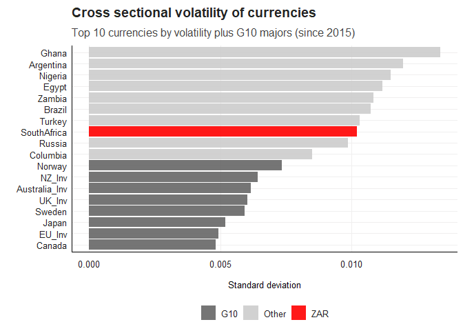<!-- -->

Again , SA is more volatile than the G10 currencies.

### 2. Analyzing ZAR return persistence

``` r
# Now i focus specifically on ZAR for deeper analysis
# Using simple returns this time instead of log returns for GARCH modeling
zar_rts <- cncy %>%  
  filter(date > ymd(20150101)) %>% # Consistent time period
  group_by(Name) %>%  
  mutate(ret = Price / lag(Price) - 1) %>% # Simple return calculation
  filter(date > dplyr::first(date)) %>% # Remove NA
  ungroup() %>%  
  mutate(Name = gsub("_Cncy", "", Name)) %>% # Clean names
  filter(Name == "SouthAfrica") %>% # Focus on ZAR only
  filter(!is.na(ret)) %>% # Remove any remaining NAs
  select(-Name, -Price) %>% # Keep only date and returns
  tbl_xts() # Convert to xts format for time series analysis

# I  Create three different return series to examine persistence (practical 6 ):
# Raw returns, squared returns (variance proxy), absolute returns (volatility proxy)
Plotdata <- cbind(zar_rts, zar_rts^2, abs(zar_rts))
colnames(Plotdata) <- c("Returns", "Returns_Sqd", "Returns_Abs")

# Convert back to tidy format for ggplot
Plotdata <- Plotdata %>% 
  xts_tbl() %>% 
  gather(ReturnType, Returns, -date)

# Plot to visually inspect persistence patterns
ggplot(Plotdata) + 
  geom_line(aes(x = date, y = Returns, colour = ReturnType, alpha = 0.5)) + 
  ggtitle("Return Type Persistence: ZAR") + 
  facet_wrap(~ReturnType, nrow = 3, ncol = 1, scales = "free") + # Separate plots for each type
  guides(alpha = "none", colour = "none") + # Remove legends
  fmxdat::theme_fmx()
```

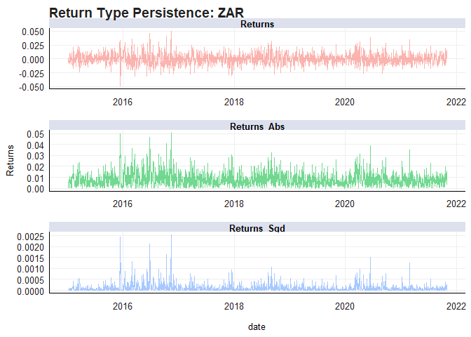<!-- -->

``` r
# Autocorrelation analysis - prep for GARCH
# If returns show no autocorrelation but squared returns do, it suggests volatility clustering
forecast::Acf(zar_rts,   main = "ACF: ZAR return")           # Check raw return persistence
```

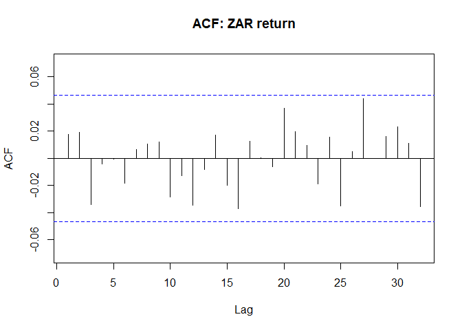<!-- -->

``` r
forecast::Acf(zar_rts^2, main = "ACF: Squared ZAR return")   # Check volatility persistence
```

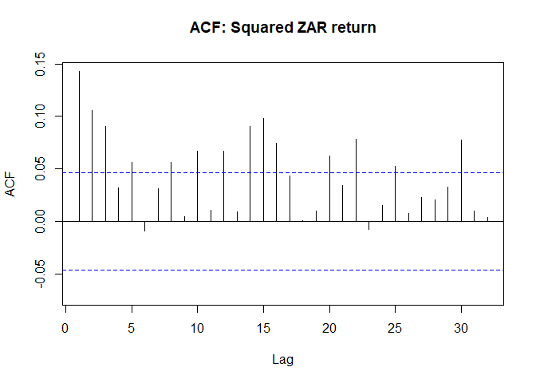<!-- -->

``` r
forecast::Acf(abs(zar_rts), main = "ACF: Absolute ZAR return") # Alternative volatility measure
```

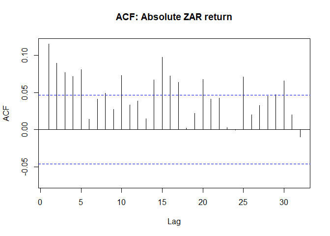<!-- -->

``` r
# Formal test for ARCH effects - significant p-value means volatility clustering exists
Box.test(coredata(zar_rts^2), type = "Ljung-Box", lag = 12)
```

    ## 
    ##  Box-Ljung test
    ## 
    ## data:  coredata(zar_rts^2)
    ## X-squared = 101.98, df = 12, p-value = 2.22e-16

“X-squared = 101.98, df = 12, p-value = 2.22e-16.” The small p-value
means we reject the null hypothesis (no autocorrelation) in the squared
returns. This suggests the presence of volatility clustering, and using
a GARCH model could help capture the time-varying risk.

### Fitting GARCH(1,1) to ZAR (rugarch, copy of Practical 6)

``` r
# Following the practical example structure for consistency
porteqw <- zar_rts # Renaming to match practical example

# Specify GARCH(1,1) model - this took some time to get right
garch11 <- ugarchspec(
  variance.model = list(
    model      = c("sGARCH","gjrGARCH","eGARCH","fGARCH","apARCH")[1], # Standard GARCH
    garchOrder = c(1, 1) # 1 ARCH term, 1 GARCH term
  ),
  mean.model = list(
    armaOrder    = c(1, 0), # AR(1) model for mean
    include.mean = TRUE     # Include constant in mean equation
  ),
  distribution.model = c("norm", "snorm", "std", "sstd", "ged", "sged", "nig", "ghyp", "jsu")[1] # Normal distribution
)

# Fit the model - this can take a moment
garchfit1 <- ugarchfit(spec = garch11, data = porteqw)

# Display results
garchfit1
```

    ## 
    ## *---------------------------------*
    ## *          GARCH Model Fit        *
    ## *---------------------------------*
    ## 
    ## Conditional Variance Dynamics    
    ## -----------------------------------
    ## GARCH Model  : sGARCH(1,1)
    ## Mean Model   : ARFIMA(1,0,0)
    ## Distribution : norm 
    ## 
    ## Optimal Parameters
    ## ------------------------------------
    ##         Estimate  Std. Error  t value Pr(>|t|)
    ## mu      0.000210    0.000228   0.9210 0.357051
    ## ar1     0.007943    0.024164   0.3287 0.742384
    ## omega   0.000002    0.000002   1.3423 0.179506
    ## alpha1  0.047048    0.013849   3.3972 0.000681
    ## beta1   0.932795    0.017406  53.5892 0.000000
    ## 
    ## Robust Standard Errors:
    ##         Estimate  Std. Error  t value Pr(>|t|)
    ## mu      0.000210    0.000223  0.94112  0.34664
    ## ar1     0.007943    0.023268  0.34135  0.73284
    ## omega   0.000002    0.000009  0.22713  0.82033
    ## alpha1  0.047048    0.062538  0.75231  0.45186
    ## beta1   0.932795    0.089069 10.47277  0.00000
    ## 
    ## LogLikelihood : 5680.695 
    ## 
    ## Information Criteria
    ## ------------------------------------
    ##                     
    ## Akaike       -6.3772
    ## Bayes        -6.3618
    ## Shibata      -6.3772
    ## Hannan-Quinn -6.3715
    ## 
    ## Weighted Ljung-Box Test on Standardized Residuals
    ## ------------------------------------
    ##                         statistic p-value
    ## Lag[1]                   0.008732  0.9255
    ## Lag[2*(p+q)+(p+q)-1][2]  1.010162  0.7338
    ## Lag[4*(p+q)+(p+q)-1][5]  2.538403  0.5555
    ## d.o.f=1
    ## H0 : No serial correlation
    ## 
    ## Weighted Ljung-Box Test on Standardized Squared Residuals
    ## ------------------------------------
    ##                         statistic p-value
    ## Lag[1]                      3.052 0.08064
    ## Lag[2*(p+q)+(p+q)-1][5]     6.107 0.08488
    ## Lag[4*(p+q)+(p+q)-1][9]     8.986 0.08182
    ## d.o.f=2
    ## 
    ## Weighted ARCH LM Tests
    ## ------------------------------------
    ##             Statistic Shape Scale P-Value
    ## ARCH Lag[3]    0.4316 0.500 2.000  0.5112
    ## ARCH Lag[5]    2.0366 1.440 1.667  0.4632
    ## ARCH Lag[7]    4.2021 2.315 1.543  0.3184
    ## 
    ## Nyblom stability test
    ## ------------------------------------
    ## Joint Statistic:  109.2884
    ## Individual Statistics:              
    ## mu     0.13325
    ## ar1    0.07617
    ## omega  6.56102
    ## alpha1 0.23967
    ## beta1  0.21190
    ## 
    ## Asymptotic Critical Values (10% 5% 1%)
    ## Joint Statistic:          1.28 1.47 1.88
    ## Individual Statistic:     0.35 0.47 0.75
    ## 
    ## Sign Bias Test
    ## ------------------------------------
    ##                    t-value    prob sig
    ## Sign Bias           0.1117 0.91110    
    ## Negative Sign Bias  0.6004 0.54835    
    ## Positive Sign Bias  1.8345 0.06675   *
    ## Joint Effect        8.9794 0.02957  **
    ## 
    ## 
    ## Adjusted Pearson Goodness-of-Fit Test:
    ## ------------------------------------
    ##   group statistic p-value(g-1)
    ## 1    20     33.82       0.0193
    ## 2    30     35.84       0.1782
    ## 3    40     47.28       0.1704
    ## 4    50     56.46       0.2162
    ## 
    ## 
    ## Elapsed time : 0.1500082

``` r
# Extract coefficient table 
garch_tab <- garchfit1@fit$matcoef
kableExtra::kable(garch_tab, caption = "GARCH(1,1) estimates for ZAR")
```

|        |  Estimate | Std. Error |    t value | Pr(\>\|t\|) |
|:-------|----------:|-----------:|-----------:|------------:|
| mu     | 0.0002100 |  0.0002280 |  0.9209990 |   0.3570509 |
| ar1    | 0.0079425 |  0.0241636 |  0.3286986 |   0.7423835 |
| omega  | 0.0000021 |  0.0000016 |  1.3422773 |   0.1795061 |
| alpha1 | 0.0470482 |  0.0138493 |  3.3971619 |   0.0006809 |
| beta1  | 0.9327955 |  0.0174064 | 53.5892150 |   0.0000000 |

GARCH(1,1) estimates for ZAR

``` r
# Plot the estimated conditional volatility from GARCH
sigma <- sigma(garchfit1) %>% xts_tbl() # Extract conditional sigma
colnames(sigma) <- c("date", "sigma") 
sigma <- sigma %>% mutate(date = as.Date(date))

# Compare GARCH volatility with simple squared returns volatility
gg <- ggplot() + 
  # Plot rolling volatility from squared returns (naive approach)
  geom_line(
    data = Plotdata %>% 
      filter(ReturnType == "Returns_Sqd") %>% 
      select(date, Returns) %>% 
      unique() %>% 
      mutate(Returns = sqrt(Returns)), # Convert variance to volatility
    aes(x = date, y = Returns)
  ) + 
  # Overlay GARCH volatility in red
  geom_line(
    data = sigma,
    aes(x = date, y = sigma),
    color = "red", size = 2, alpha = 0.8
  ) + 
  labs(
    title    = "Comparison: Returns sigma vs sigma from GARCH",
    subtitle = "ZAR: note the smoothing effect of GARCH as noise is controlled for.",
    x = "", y = "Estimated volatility",
    caption = "Source: Financial econometrics practical | Calculations: Own"
  ) + 
  fmxdat::theme_fmx(CustomCaption = TRUE)


fmxdat::finplot(gg, y.pct = TRUE, y.pct_acc = 1)
```

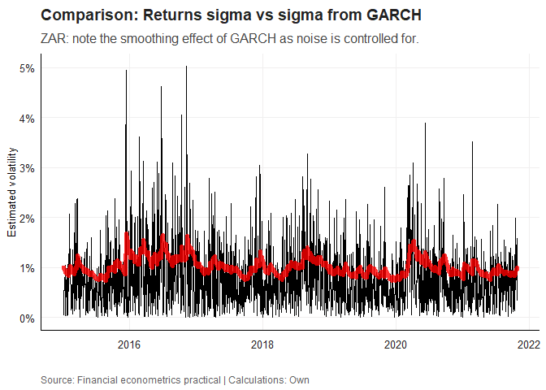<!-- -->

``` r
# News Impact Curve - shows how news (shocks) affect future volatility
ni <- newsimpact(z = NULL, garchfit1)

# Plot the NIC - I struggled to understand this at first
# It shows asymmetry: how positive vs negative shocks impact volatility differently
plot(
  ni$zx, ni$zy,
  ylab = ni$yexpr,
  xlab = ni$xexpr,
  type = "l",
  main = "News Impact Curve: ZAR sGARCH(1,1)"
)
```

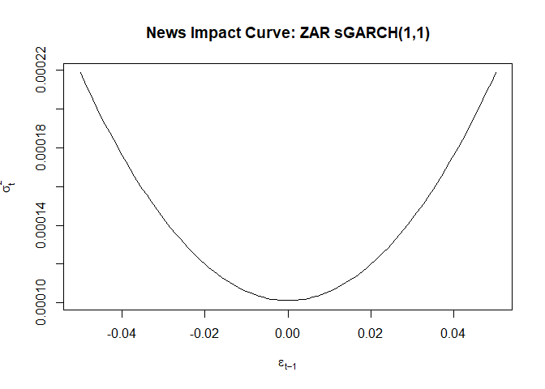<!-- -->

### Alternative GARCH forms for ZAR (GJR and EGARCH) and NIC comparison

``` r
# Standard GARCH assumes symmetric volatility response
# But in finance, negative shocks often increase volatility more (leverage effect)
# So i try asymmetric GARCH models

# GJR-GARCH with student t distribution - accounts for leverage effect
gjrgarch11 <- ugarchspec(
  variance.model = list(
    model      = c("sGARCH","gjrGARCH","eGARCH","fGARCH","apARCH")[2], # GJR-GARCH
    garchOrder = c(1, 1)
  ),
  mean.model = list(
    armaOrder    = c(1, 0),
    include.mean = TRUE
  ),
  distribution.model = c("norm", "snorm", "std", "sstd", "ged", "sged", "nig", "ghyp", "jsu")[3] # Student t
)

garchfit2 <- ugarchfit(spec = gjrgarch11, data = as.matrix(porteqw))

# Display results
kableExtra::kable(
  garchfit2@fit$matcoef,
  caption = "GJR GARCH(1,1) with student t distribution for ZAR"
)
```

|        |   Estimate | Std. Error |     t value | Pr(\>\|t\|) |
|:-------|-----------:|-----------:|------------:|------------:|
| mu     |  0.0001830 |  0.0002287 |   0.8004381 |   0.4234570 |
| ar1    |  0.0015262 |  0.0239441 |   0.0637397 |   0.9491775 |
| omega  |  0.0000012 |  0.0000007 |   1.7036342 |   0.0884494 |
| alpha1 |  0.0473653 |  0.0071176 |   6.6547069 |   0.0000000 |
| beta1  |  0.9645691 |  0.0038471 | 250.7238625 |   0.0000000 |
| gamma1 | -0.0502927 |  0.0112761 |  -4.4601190 |   0.0000082 |
| shape  | 14.0711878 |  4.0824995 |   3.4467090 |   0.0005675 |

GJR GARCH(1,1) with student t distribution for ZAR

``` r
# EGARCH - another asymmetric model with exponential form
egarch11 <- ugarchspec(
  variance.model = list(
    model      = c("sGARCH","gjrGARCH","eGARCH","fGARCH","apARCH")[3], # EGARCH
    garchOrder = c(1, 1)
  ),
  mean.model = list(
    armaOrder    = c(1, 0),
    include.mean = TRUE
  ),
  distribution.model = c("norm", "snorm", "std", "sstd", "ged", "sged", "nig", "ghyp", "jsu")[3] # Student t
)

garchfit3 <- ugarchfit(spec = egarch11, data = as.matrix(porteqw))

# Model diagnostics and comparison
signbias(garchfit1) # Test for sign bias - if significant, asymmetric models are better
```

    ##                      t-value       prob sig
    ## Sign Bias          0.1116684 0.91109896    
    ## Negative Sign Bias 0.6003544 0.54834668    
    ## Positive Sign Bias 1.8344545 0.06675385   *
    ## Joint Effect       8.9793762 0.02956635  **

``` r
infocriteria(garchfit1) # Information criteria for model selection
```

    ##                       
    ## Akaike       -6.377186
    ## Bayes        -6.361780
    ## Shibata      -6.377202
    ## Hannan-Quinn -6.371496

``` r
infocriteria(garchfit2)
```

    ##                       
    ## Akaike       -6.391203
    ## Bayes        -6.369635
    ## Shibata      -6.391233
    ## Hannan-Quinn -6.383237

``` r
infocriteria(garchfit3)
```

    ##                       
    ## Akaike       -6.387688
    ## Bayes        -6.366120
    ## Shibata      -6.387718
    ## Hannan-Quinn -6.379722

``` r
# Compare News Impact Curves across all three models
#function to extract NIC data - copied from practical
NICurveMaker <- function(Fit, Name) {
  NI <- newsimpact(z = NULL, Fit)
  NI <- cbind(NI$zx, NI$zy)
  colnames(NI) <- c(paste0("Epsilon_", Name), paste0("Sigma_", Name))
  NI %>% data.frame() %>% tibble::as_tibble()
}

# Extract NIC data for all three models
NI1 <- NICurveMaker(garchfit1, "GARCH11")
NI2 <- NICurveMaker(garchfit2, "GJR")
NI3 <- NICurveMaker(garchfit3, "EGARCH")

# Combine and reshape for plotting
NI <- cbind(NI1, NI2, NI3) %>% 
  gather(Model, Sigma, starts_with("Sigma")) %>% 
  rename(Epsilon = Epsilon_GARCH11) %>% 
  select(-Epsilon_GJR, -Epsilon_EGARCH)

# Plot comparison - this clearly shows asymmetry differences
ggplot(NI) + 
  geom_line(aes(x = Epsilon, y = Sigma, colour = Model)) + 
  ggtitle("News Impact Curves: ZAR") + 
  theme_hc()
```

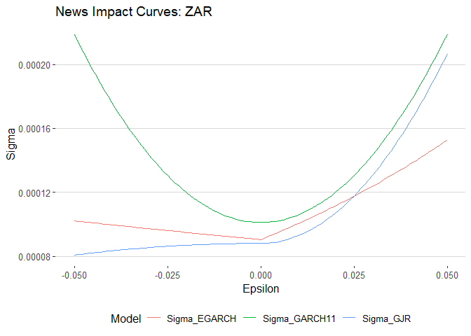<!-- -->

### GO GARCH and time varying correlation between ZAR and Dollar strength

``` r
# Now  i  examine the second statement about Dollar strength using prac 7 - multivariate analysis
#I analyse the  correlation between ZAR and Dollar index

# Calculate Dollar index log returns
g10_rts <- bbdxy %>% 
  arrange(date) %>% 
  mutate(G10 = log(Price) - log(lag(Price))) %>% # Log returns for Dollar index
  filter(date > dplyr::first(date)) %>% 
  select(date, G10)

# Get ZAR log returns from our earlier calculation
zar_log_rts <- cncy_rts %>% 
  filter(Name == "SouthAfrica") %>% 
  rename(ZAR = dlogret) %>% 
  select(date, ZAR)

# Merge and convert to xts for multivariate GARCH
xts_rtn <- left_join(g10_rts, zar_log_rts, by = "date") %>% 
  drop_na() %>% # Remove any missing values
  tbl_xts() # Convert to xts format
```

``` r
# function from practical to rename DCC correlation outputs
# This was complex - had to carefully study how the correlation matrices are structured ( struggled a bit )
renamingdcc <- function(ReturnSeries, DCC.TV.Cor) {
  dates <- zoo::index(ReturnSeries)
  N     <- ncol(ReturnSeries)
  names <- colnames(ReturnSeries)
  
  # Create all possible pairs
  pairs      <- expand.grid(names, names)
  pair_names <- paste0(pairs$Var1, "_", pairs$Var2)
  
  df <- as.data.frame(DCC.TV.Cor)
  colnames(df) <- pair_names
  df$date      <- dates
  
  # Reshape to long format for plotting
  df %>% 
    tidyr::pivot_longer(
      cols      = -date,
      names_to  = "Pairs",
      values_to = "Rho"
    ) %>% 
    dplyr::arrange(date)
}
```

``` r
# GO-GARCH model for multivariate volatility
# This allows us to estimate time-varying correlation

# First specify univariate GARCH models for each series
uspec <- ugarchspec(
  variance.model = list(
    model      = "gjrGARCH", # Using GJR-GARCH for asymmetry
    garchOrder = c(1, 1)
  ),
  mean.model = list(
    armaOrder    = c(1, 0),
    include.mean = TRUE
  ),
  distribution.model = "sstd" # Skewed student t for fat tails and asymmetry
)

# Replicate specification for both series
multi_univ_garch_spec <- multispec(replicate(ncol(xts_rtn), uspec))

# GO-GARCH specification 
spec.go <- gogarchspec(
  multi_univ_garch_spec,
  distribution.model = "mvnorm", # Multivariate normal
  ica                = "fastica" # Independent component analysis
)

# Use parallel processing - this speeds up estimation significantly
cl <- makePSOCKcluster(10)

# Fit univariate models first
multf <- multifit(multi_univ_garch_spec, xts_rtn, cluster = cl)

# Fit GO-GARCH model - this can take a while
fit.gogarch <- gogarchfit(
  spec    = spec.go,
  data    = xts_rtn,
  solver  = "hybrid",
  cluster = cl,
  gfun    = "tanh",
  maxiter1 = 40000,
  epsilon  = 1e-08,
  rseed    = 100
)

stopCluster(cl) # Always stop cluster when done

print(fit.gogarch)
```

    ## 
    ## *------------------------------*
    ## *        GO-GARCH Fit          *
    ## *------------------------------*
    ## 
    ## Mean Model       : CONSTANT
    ## GARCH Model      : sGARCH
    ## Distribution : mvnorm
    ## ICA Method       : fastica
    ## No. Factors      : 2
    ## No. Periods      : 4390
    ## Log-Likelihood   : 33146.13
    ## ------------------------------------
    ## 
    ## U (rotation matrix) : 
    ## 
    ##       [,1]   [,2]
    ## [1,] 0.746  0.666
    ## [2,] 0.666 -0.746
    ## 
    ## A (mixing matrix) : 
    ## 
    ##           [,1]    [,2]
    ## [1,] -0.000363 0.00406
    ## [2,]  0.008454 0.00655

``` r
# Extract time-varying correlations
gog.time.var.cor <- rcor(fit.gogarch)
gog.time.var.cor <- aperm(gog.time.var.cor, c(3, 2, 1)) # Rearrange dimensions
dim(gog.time.var.cor) <- c(
  nrow(gog.time.var.cor),
  ncol(gog.time.var.cor)^2
)

# Use renamingdcc function to rename and reshape
gog.time.var.cor <- renamingdcc(
  ReturnSeries = xts_rtn,
  DCC.TV.Cor   = gog.time.var.cor
)

# Plot the time-varying correlation between ZAR and Dollar index
g2 <- ggplot(
  gog.time.var.cor %>% 
    filter(grepl("ZAR_", Pairs), !grepl("_ZAR", Pairs)) # Get ZAR pairs but not ZAR_ZAR
) +
  geom_line(aes(x = date, y = Rho, colour = Pairs)) +
  theme_hc() +
  ggtitle("Go GARCH: time varying correlation between ZAR and Dollar index")

print(g2)
```

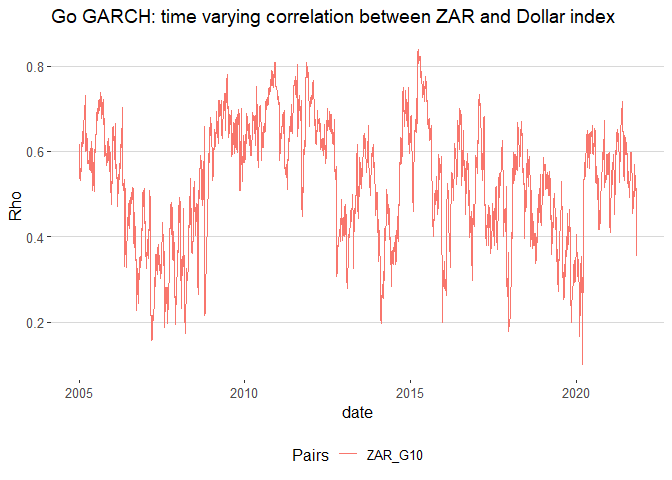<!-- -->

------------------------------------------------------------------------

### G10 carry and PPP value (for narrative)

I added this but was unsure about it

``` r
# Finally, let's examine the relationships mentioned in the second statement
# Calculate returns for all relevant series

# ZAR returns (already calculated)
zar_daily <- cncy_rts %>% filter(Name == "SouthAfrica") %>% select(date, ZAR = dlogret)

# G10 carry index returns
carry_rts <- cncy_Carry %>% 
  arrange(date) %>% 
  mutate(Carry = log(Price) - log(lag(Price))) %>% 
  filter(!is.na(Carry)) %>% 
  select(date, Carry)

# PPP value index returns  
value_rts <- cncy_value %>% 
  arrange(date) %>% 
  mutate(Value = log(Price) - log(lag(Price))) %>% 
  filter(!is.na(Value)) %>% 
  select(date, Value)

# Dollar index returns (alternative calculation)
dxy_rts <- bbdxy %>% 
  arrange(date) %>% 
  mutate(DXY = log(Price) - log(lag(Price))) %>% 
  filter(!is.na(DXY)) %>% 
  select(date, DXY)

# Combine all series
link_df <- zar_daily %>% 
  inner_join(carry_rts, by = "date") %>% 
  inner_join(value_rts, by = "date") %>% 
  inner_join(dxy_rts,   by = "date")

# Calculate correlation matrix - this gives us the relationships
round(cor(link_df %>% select(-date), use = "complete.obs"), 3)
```

    ##          ZAR  Carry  Value    DXY
    ## ZAR    1.000 -0.326  0.246  0.539
    ## Carry -0.326  1.000 -0.142 -0.202
    ## Value  0.246 -0.142  1.000  0.322
    ## DXY    0.539 -0.202  0.322  1.000

ZAR ranks as the 8th most volatile currency among 41 currencies in the
sample (starting year = 2015 , if we change it to 2016/2017 it moves up
to number 5), and is more volatile than all G10 currencies. Univariate
GARCH models confirm strong and persistent volatility clustering for
ZAR. The asymmetric GJR GARCH model further suggests that positive
shocks to ZAR returns increase volatility more than negative shocks of
the same magnitude.

ZAR shows moderate relationships with carry and value factors, with
correlations of about −0.33 with the G10 carry index and +0.25 with the
value index. However, the claim that ZAR benefits from periods of strong
Dollar performance is not supported by the data. ZAR returns are
positively correlated with the Dollar index (about +0.54), which in this
quotation convention means that ZAR typically weakens when the Dollar
strengthens. GO GARCH results indicate that this relationship is time
varying, so in this sample the statement is not strongly supported.

The GJR GARCH model indicates that ZAR volatility responds more strongly
to positive shocks than to negative shocks (γ ≈ −0.05), which is the
opposite of the usual leverage effect found in equity markets. This
points to a different volatility mechanism for ZAR, consistent with the
idea that good news rallies and periods of strong inflows can be
associated with elevated and persistent volatility in an emerging market
currency.

# QUESTION 5: Global Balanced Index Fund Portfolio Construction

We want to construct a global balanced index fund portfolio using a mix
of traded global indexes.

## Load all required packages at the top

``` r
# Load all required packages
pacman::p_load(
  tidyverse,      
  xts,            
  tbl2xts,        
  RiskPortfolios, 
  PerformanceAnalytics,
  PortfolioAnalytics,   
  lubridate,      
  kableExtra,   
  quadprog,       # For quadratic optimization
  cluster,        # For hierarchical clustering
  readr,          
  dplyr         
)


devtools::source_gist("https://gist.github.com/Nicktz/bd2614f8f8a551881a1dc3c11a1e7268")
```

## DATA LOADING AND PREPARATION

``` r
MAA_data <- read_rds("data/MAA.rds") %>%
  filter(Ticker %in% c("LUACTRUU Index", "LUAGTRUU Index",
                       "BCOMTR Index", "LP05TREH Index"))

# Load and filter MSCI equity indices
msci_data <- read_rds("data/msci.rds") %>%
  filter(Name %in% c("MSCI ACWI", "MSCI USA", "MSCI RE",
                     "MSCI Jap", "MSCI China"))

# Combine all datasets 
df_full <- bind_rows(
  msci_data %>% rename(Tickers = Name),
  MAA_data %>% select(-Name) %>% rename(Tickers = Ticker)
) %>%
  arrange(date)  

# Create monthly returns from 2011
monthly_df <- df_full %>%
  filter(date >= ymd(20110101)) %>%       
  group_by(Tickers) %>%
  # Keep only assets with at least 5 years of data 
  filter(n_distinct(year(date)) >= 5) %>% 
  ungroup() %>%
  mutate(YM = format(date, "%Y%m")) %>%
  arrange(date) %>%
  group_by(Tickers, YM) %>%
  filter(date == dplyr::last(date)) %>%
  # Calculate monthly returns
  group_by(Tickers) %>%
  mutate(ret = Price / lag(Price) - 1) %>%
  ungroup() %>%
  select(date, Tickers, ret) %>%
  filter(!is.na(ret))   

# Convert to wide format matrix for portfolio optimization
return_mat <- monthly_df %>%
  spread(Tickers, ret)

return_mat_Nodate <- data.matrix(return_mat[, -1])
```

## PORTFOLIO OPTIMIZER FUNCTION

``` r
optim_foo <- function(return_mat,
                      end_date,
                      lookback_months = 120,    # 10 years of monthly data
                      LB        = 0.01,         # Minimum 1% per asset
                      UB        = 0.35,         # Maximum 35% per single asset
                      bond_UB   = 0.25,         # Bonds max 25% of portfolio
                      eq_UB     = 0.60,         # Equities max 60%
                      com_UB    = 0.15) {       # Commodities max 15%
  
  # 1. SELECT LOOKBACK WINDOW
  window_df <- return_mat %>%
    filter(date <= end_date) %>%
    arrange(date) %>%
    slice_tail(n = lookback_months)  # Last 'lookback_months' observations
  
  # Safety check - ensure we have enough data
  if (nrow(window_df) < lookback_months) {
    warning("Not enough history for lookback at ", end_date)
    return(NULL)
  }
  
  #  Remove assets with insufficient history
  X <- data.matrix(window_df[, -1])  
  
  # Keep only assets with at least 60 non-NA observations (5 years)
  valid_cols    <- colSums(!is.na(X)) >= 60
  X_valid       <- X[, valid_cols, drop = FALSE]
  assets_valid  <- colnames(X_valid)
  
  if (length(assets_valid) == 0) {
    warning("No assets with >= 5 years of data in window ending ", end_date)
    return(NULL)
  }
  
  # 3. ESTIMATE COVARIANCE AND RETURNS
  # Using Ledoit-Wolf shrinkage for better covariance estimation
  Sigma <- RiskPortfolios::covEstimation(X_valid)
  
  # Calculate geometric mean returns (more appropriate for compounding)
  Mu <- window_df %>%
    select(date, all_of(assets_valid)) %>%
    summarise(across(-date, ~ prod(1 + .)^(1 / n()) - 1)) %>%
    purrr::as_vector()
  
  N <- length(assets_valid)  # Number of valid assets
  
  asset_class <- case_when(
    assets_valid == "BCOMTR Index" ~ "Commodity",
    assets_valid %in% c(
      "LGAGTRUH Index", "LUAGTRUU Index", "LEATTREU Index",
      "LGCPTREH Index", "LUACTRUU Index", "LP05TREH Index"
    ) ~ "BondCredit",
    TRUE ~ "Equity"
  )
  
  # Create indices for each asset class for constraint application
  bond_idx <- which(asset_class == "BondCredit")
  eq_idx   <- which(asset_class == "Equity")
  com_idx  <- which(asset_class == "Commodity")
  
  # 5. CONSTRAINTS MATRIX
  # Base constraints: sum(weights)=1, lower bounds, upper bounds
  Amat <- cbind(
    rep(1, N),         # Sum of weights = 1 (fully invested)
    diag(N),           # Lower bounds: w_i >= LB
    -diag(N)           # Upper bounds: w_i <= UB (via -w_i >= -UB)
  )
  
  bvec <- c(
    1,                 # Fully invested constraint
    rep(LB, N),        # Lower bounds
    -rep(UB, N)        # Upper bounds (negative due to inequality direction)
  )
  
  #function to add group constraints
  add_group_constraint <- function(idx, cap, Amat, bvec) {
    if (length(idx) == 0) return(list(Amat = Amat, bvec = bvec))
    
    g_vec <- rep(0, nrow(Amat))   # Initialize constraint vector
    g_vec[idx] <- -1              # -sum(w_group) >= -cap
    Amat_new <- cbind(Amat, g_vec)
    bvec_new <- c(bvec, -cap)
    list(Amat = Amat_new, bvec = bvec_new)
  }
  

  tmp <- add_group_constraint(bond_idx, bond_UB, Amat, bvec)
  Amat <- tmp$Amat; bvec <- tmp$bvec
  
  tmp <- add_group_constraint(eq_idx,   eq_UB,   Amat, bvec)
  Amat <- tmp$Amat; bvec <- tmp$bvec
  
  tmp <- add_group_constraint(com_idx,  com_UB,  Amat, bvec)
  Amat <- tmp$Amat; bvec <- tmp$bvec
  
  meq <- 1  # First constraint (sum to 1) is equality
  
  # 6. SOLVE QUADRATIC PROGRAM
  #  min (1/2) w' Sigma w - mu' w
  w.opt <- quadprog::solve.QP(
    Dmat = Sigma,    # Covariance matrix
    dvec = Mu,       # Expected returns  
    Amat = Amat,     # Constraints matrix
    bvec = bvec,     # Constraints vector
    meq  = meq       # Number of equality constraints
  )$solution
  
  tibble(
    date   = end_date,
    stocks = assets_valid,
    weight = as.numeric(w.opt)
  )
}
```

## 3. REBALANCING

``` r
# Get quarter-end dates (Jan, Apr, Jul, Oct) for rebalancing (Why ?? )
EOQ_datevec <- return_mat %>%
  select(date) %>%
  distinct() %>%
  filter(month(date) %in% c(1, 4, 7, 10)) %>%  # Quarter-end months
  pull(date)
```

## ROLLING OPTIMIZATION

``` r
# Wrapper function for rolling optimization
Roll_optimizer <- function(return_mat,
                           EOQ_datevec,
                           LookBackSel = 120,    # 10-year lookback
                           ...) {
  optim_foo(return_mat,
            end_date        = EOQ_datevec,
            lookback_months = LookBackSel,
            ...)
}

# Execute rolling optimization across all quarter-end dates
Result_roll <- EOQ_datevec %>%
  map_df(~ Roll_optimizer(return_mat,
                          EOQ_datevec = .,
                          LookBackSel = 120))

# Display 
kable(Result_roll %>% head(13))
```

| date       | stocks         | weight |
|:-----------|:---------------|-------:|
| 2021-01-29 | BCOMTR Index   |   0.15 |
| 2021-01-29 | LP05TREH Index |   0.01 |
| 2021-01-29 | LUACTRUU Index |   0.23 |
| 2021-01-29 | LUAGTRUU Index |   0.01 |
| 2021-01-29 | MSCI ACWI      |   0.22 |
| 2021-01-29 | MSCI China     |   0.01 |
| 2021-01-29 | MSCI Jap       |   0.01 |
| 2021-01-29 | MSCI RE        |   0.01 |
| 2021-01-29 | MSCI USA       |   0.35 |
| 2021-04-30 | BCOMTR Index   |   0.15 |
| 2021-04-30 | LP05TREH Index |   0.01 |
| 2021-04-30 | LUACTRUU Index |   0.23 |
| 2021-04-30 | LUAGTRUU Index |   0.01 |

## 5. PORTFOLIO WEIGHTS VISUALIZATION

``` r
# Prepare data for stacked bar chart
bar_xts <- Result_roll %>%
  select(date, stocks, weight) %>%
  spread(stocks, weight) %>%
  tbl_xts() %>%                    # Convert to xts format
  .[endpoints(., "months")]        # Keep only month-end points

# Create stacked bar chart of portfolio weights over time
chart.StackedBar(
  bar_xts,
  main = "Quarterly Rebalanced Global Balanced Index Fund",
  ylab = "Portfolio Weight",
  xlab = "Date"
)
```

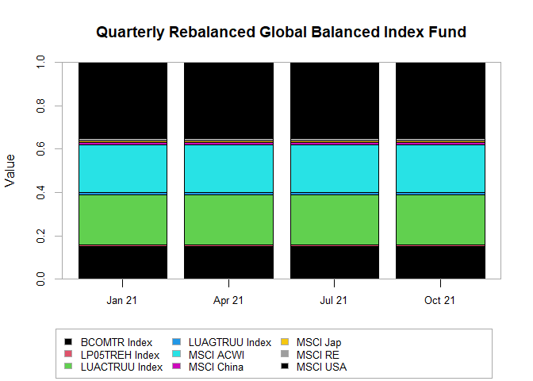<!-- -->

## 6. CLUSTERING ANALYSIS FOR COMOVEMENT (prac 5 )

``` r
# CLUSTERING BASED COMOVEMENT ANALYSIS
# Remove date column for clustering
clust_mat <- return_mat %>%
  select(-date)

# 6.1 Estimate shrunk correlation matrix (Ledoit-Wolf)
Sigma_clust <- RiskPortfolios::covEstimation(
  as.matrix(clust_mat),
  control = list(type = "lw")  # Ledoit-Wolf shrinkage
)

# Convert to correlation matrix
corr_clust <- cov2cor(Sigma_clust)


# Distance = sqrt((1 - correlation)/2)
distmat <- ((1 - corr_clust) / 2)^0.5

# 6.3 Hierarchical clustering with Ward's method
hc <- cluster::agnes(dist(distmat), method = "ward")

# Plot dendrogram to visualize clusters
plot(hc, 
     which.plot = 2, 
     main = "Hierarchical Clustering of Global Indices",
     xlab = "Indices", 
     sub = "",
     cex = 0.7)  # Smaller text for better fit
```

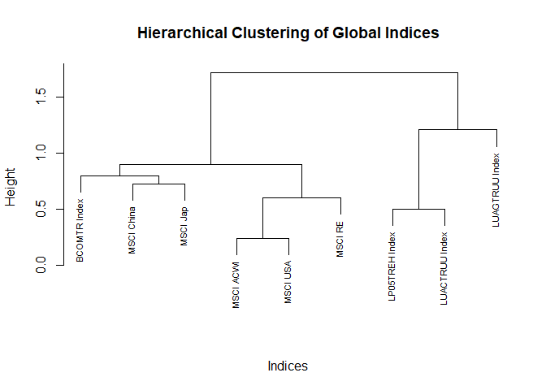<!-- -->
